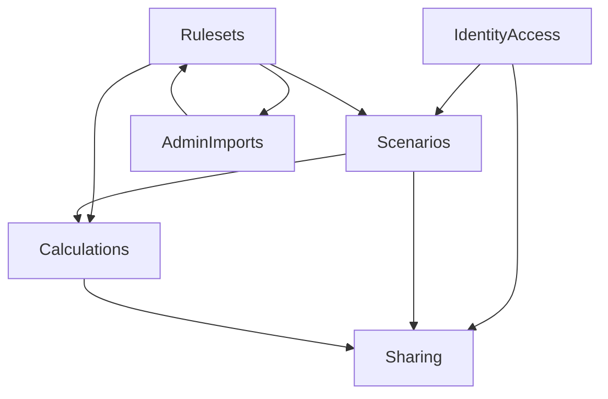

# Architecture Overview

## 概要

このドキュメントは、リポジトリ全体に対して影響の大きい設計変更の境界を俯瞰するための一覧です。リポジトリ直下の [`../ARCHITECTURE.md`](../ARCHITECTURE.md) が生成される `.NET` アプリケーションの基礎アーキテクチャを扱うのに対し、本書は issue ごとの設計スライス、実装状況、関連ドキュメントへの導線を整理します。

| 項目 | 内容 |
|---|---|
| 現在の役割 | 影響モジュール一覧、責務境界、承認済みスコープの実装状況を明示 |
| 基礎アーキテクチャ | [`../ARCHITECTURE.md`](../ARCHITECTURE.md) |
| Issue #1 関連設計 | [Pokemon Story Damage Calculator API Foundation](designs/pokemon-story-damage-calculator-api-foundation.md) |
| Issue #1 関連テスト | [Pokemon Story Damage Calculator Foundation Test Plan](tests/pokemon-story-damage-calculator-foundation-test-plan.md) |
| Issue #8 関連設計 | [Bootstrap Foundation Design](designs/bootstrap-foundation.md) |
| Issue #8 関連テスト | [Bootstrap Foundation Test Plan](tests/bootstrap-foundation-test-plan.md) |

## Tracked Slice Status

| Slice | Issue | Phase / Step | Status |
|---|---|---|---|
| Pokemon story damage calculator foundation | #1 | Phase 3 / Step 3.4.5 | implementation-aligned |
| Bootstrap foundation redesign | #8 | Phase 3 / Step 3.4.5 | implementation-aligned |

## ドキュメント境界

| ドキュメント | 主な責務 | この Issue で参照する理由 |
|---|---|---|
| [`../ARCHITECTURE.md`](../ARCHITECTURE.md) | 生成される `.NET` テンプレートの Clean Architecture / DDD 原則 | `.NET` sample 再編時に守る基礎原則を確認するため |
| `architecture.md` | リポジトリ全体の設計スライスと変更境界を定義 | Issue #1 / #8 の変更境界を明確にするため |

## Issue #1: Pokemon Story Damage Calculator Scope Impact

### 実装済みサマリ

| 観点 | 実装状況 |
|---|---|
| サンプル置換 | `WeatherForecast` は撤去済みで、`Program.cs` の minimal API が story calculator foundation を公開する |
| モジュール境界 | `Rulesets`, `Runs/Routes`, `BattleParticipation`, `ProgressionProjection`, `Calculations`, `Sharing`, `IdentityAccess`, `AdminImports` を `PokemonStoryService` と独立した進捗計算補助へ束ねる |
| 状態の authority | `RunInitialState`（最大 6 体 party）、ordered `ProgressionEvent`、`BattleParticipationPlan`、`MasterVersionSet`、`BattleDefinition` / `EnemyGroupDefinition` を保存し、verification / progression / damage / diff は導出する |
| 認証と認可 | 通常実行時は Google access token bearer、run 系は所有者必須、admin 系は `Administrator` ロール必須 |
| 現時点の簡略化 | import は job 作成中心、share 公開範囲は `public` のみ匿名 read、damage / progression / threshold / diff は foundation 用の簡易ロジック |

### モジュール関係

### 実装順序上で更新対象となるレイヤー

| Layer | 主な責務 | Sequencing note |
|---|---|---|
| Domain | records 中心の authority model、party progression、damage result、share/import artifact を定義 | `PokemonType` と `VersionCatalog` を domain の核として持つ |
| Application | `PokemonStoryService` が run 管理、verification、progression、damage、share、import を集約する | `StoryProgressionProjector` と `PokemonTypeChart` を分離し、EXP / EV / PP と damage を別コードパスにした |
| Infrastructure | EF Core + SQL Server / InMemory、JSON 永続化 repository、初期 seed を提供する | 非 production 起動時に migration と seed を自動適用する |
| Web | minimal API、Google bearer auth、Swagger、problem details を提供する | 開発環境のみ Swagger UI を公開する |
| Tests | service test と API E2E で foundation 契約を固定する | SQL Server 永続化や Google 実トークン検証までは未自動化 |

### 実装済み capability map

| Capability | 実装状況 | Notes |
|---|---|---|
| rulesets / master version set | 実装済み | ruleset 一覧/詳細、version set 詳細、admin 一覧/公開を提供 |
| run / initial state / route / progression events | 実装済み | 最大 6 体 party、simulation scope、per-member delta を保存し stale 管理を提供 |
| battle participation / progression projection | 実装済み | battle ごとの participation 更新、route progression 取得 / 再計算、PP warning を提供 |
| battle quick search | 実装済み | title と敵要約で検索する簡易 quick search |
| route-wide verification | 実装済み | 初期状態欠落、party/participation 整合性、event sequence gap、enemy group 欠落、arbitrary battle 空、optional battle warning、PP warning を検出 |
| single-case damage calculation | 実装済み | STAB、中央管理のタイプ相性、急所、追加 modifier、PP warning を使う簡易式 |
| compare-patterns | 実装済み | base case から move power / attack bonus / extra modifiers を比較する |
| threshold-search | 実装済み | 初期状態と先頭敵を使う簡易探索 |
| sharing / comments / diff / revision | 実装済み | snapshot publish、revision publish、comment、構造 diff を提供 |
| admin import / master maintenance | 実装済み | dry-run / commit job と publish endpoint を提供 |
| spreadsheet import parser | 未実装 | workbook 名を受ける foundation stub。実ファイル解析は未着手 |
| share visibility enforcement | 実装済み | `public` のみ匿名 read 可、`private` / `unlisted` は owner 限定 |

## Issue #8: Bootstrap Foundation Top-Level Areas

| Area | Responsibility | Implemented detail |
|---|---|---|
| Bootstrap workflow | 選択 framework に応じた生成物の確定 | README / workflow / tasks / compose / Dockerfile の選択と cleanup を実施 |
| Workflow availability | framework ごとの test → build/push → deploy 契約と branch trigger | `.github/workflows/main.yml` の生成後検証まで含めて保証 |
| Documentation flow | Base README と Generated README の責務分離 | framework 別 README 生成と required / forbidden section 検証を実施 |
| AI assets packaging | `.github/agents` / `.github/skills` の同梱と整理ルール | framework 非依存アセットは残し、不要 bootstrap 補助資産は cleanup する |
| Guardrail integration | `configure_copilot_guardrails` の warn / skip / no-op と利用者通知 | best-effort 適用、unsupported 条件の warning、summary 反映を実施 |
| `.NET` sample application | Documents 系サンプル、管理 API、初回管理者 seed | [Bootstrap Foundation Design](designs/bootstrap-foundation.md#net-sample-architecture) |
| Validation | bootstrap 契約、README 契約、workflow 契約、API 契約の検証 | [Bootstrap Foundation Test Plan](tests/bootstrap-foundation-test-plan.md) |

## Issue #8: Impact Module Map

| Module / Path | Planned responsibility |
|---|---|
| `.github/workflows/template-bootstrap.yml` | framework 単一生成、generated `main.yml` / `README.md` の契約検証、ACA / guardrail summary の出力 |
| `.github/workflow-templates/**` | `develop` / `main` / `copilot/**` 向け workflow 雛形の framework 別選択と `main.yml` への昇格元 |
| `.github/agents/**` | 生成後リポジトリに同梱するエージェント定義 |
| `.github/skills/**` | 生成後リポジトリに同梱するスキル定義 |
| `.vscode/**` | framework 別 tasks / launch / settings の残存制御 |
| `docker-compose*.yml` | framework 別のローカル開発・検証構成の残存制御 |
| `scripts/bootstrap-template.ps1` | framework 別 README 生成、port 置換、不要 workflow / Docker / script の cleanup |
| `scripts/configure-github-guardrails.ps1` | best-effort guardrail 実行、ruleset unsupported 条件の skip / warning 出力 |
| `templates/dotnet8/**` | Documents 系サンプル、管理 API、seed、認可モデル更新 |
| `templates/dotnet10/**` | dotnet8 と同一意図の横展開 |
| `templates/next/**` | Next.js 向け生成物、README、workflow 導線の最適化 |
| `README.md` | ベースリポジトリ説明への責務限定 |
| `docs/**` | 設計契約、テスト観点、レビュー用トレーサビリティ |

## Cross-Cutting Rules

- bootstrap 後の生成物には選択 framework の資産のみを残す
- Base README はベースソリューション自体の説明に限定する
- Generated README は framework 別に script 生成し、bootstrap workflow で required / forbidden section を検証する
- `next` Generated README には `.NET` 専用手順を含めず、`dotnet8` / `dotnet10` Generated README には SQL Server / EF Core / Infrastructure test 手順を含める
- AI assets は同梱するが、framework 依存資産は bootstrap script の framework contract に従って整理する
- generated `main.yml` は `develop` / `main` / `copilot/**` push で `test → build/push → deploy` を提供し、deploy は `ACA_DEPLOY_ENABLED` と関連 variables が揃う場合のみ実行する
- `create_aca=false` では生成成功を優先し、`ACA_DEPLOY_ENABLED=false` を設定した上で ACA 自動作成のみを summary 付きで skip する
- guardrail は best-effort とし、unsupported 条件では warning と `skipped` message を返して生成処理を継続する
- 生成後リポジトリでは `scripts/configure-github-guardrails.ps1` は残し、`scripts/bootstrap-template.ps1` と `.github/workflows/template-bootstrap.yml` は削除する
- `.NET` テンプレートは target framework 差分を除き構成・API・README・検証観点を揃える
- story damage calculator では `RunInitialState` と ordered `ProgressionEvent` を mutable authority とし、導出 read model を直接更新しない
- ruleset / master version set は calculation determinism と snapshot reproducibility の境界として扱う
