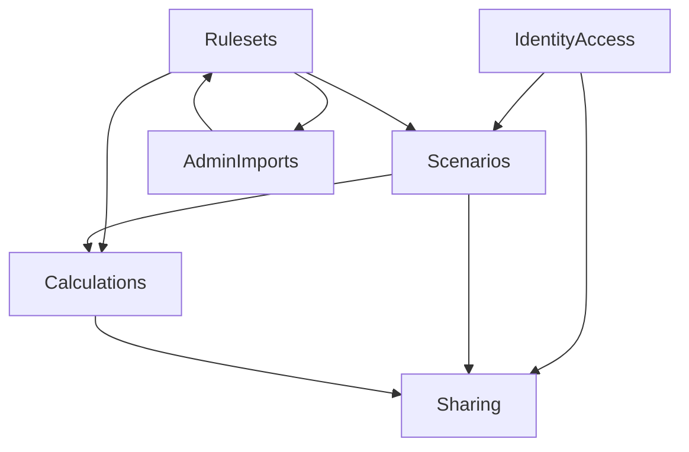

# Architecture Overview

## 概要

このドキュメントは、リポジトリ全体に対して影響の大きい設計変更の境界を俯瞰するための一覧です。リポジトリ直下の [`../ARCHITECTURE.md`](../ARCHITECTURE.md) が生成される `.NET` アプリケーションの基礎アーキテクチャを扱うのに対し、本書は issue ごとの設計スライス、承認済み契約、Phase 2 の設計骨子と Phase 3 で満たすべき責務境界を整理します。

| 項目 | 内容 |
|---|---|
| 現在の役割 | 影響モジュール一覧、責務境界、承認済みスコープの必須契約を明示 |
| 基礎アーキテクチャ | [`../ARCHITECTURE.md`](../ARCHITECTURE.md) |
| Issue #1 関連設計 | [Pokemon Story Damage Calculator API Design](designs/pokemon-story-damage-calculator-api-design.md) |
| Issue #1 関連テスト | [Pokemon Story Damage Calculator Test Plan](tests/pokemon-story-damage-calculator-test-plan.md) |
| Issue #8 関連設計 | [Bootstrap Foundation Design](designs/bootstrap-foundation.md) |
| Issue #8 関連テスト | [Bootstrap Foundation Test Plan](tests/bootstrap-foundation-test-plan.md) |

## Tracked Slice Status

| Slice | Issue | Phase / Step | Status |
|---|---|---|---|
| Pokemon story damage calculator | #1 | Phase 2 / Step 2.2.5 | design-aligned |
| Bootstrap foundation redesign | #8 | Phase 3 / Step 3.4.5 | implementation-aligned |

## ドキュメント境界

| ドキュメント | 主な責務 | この Issue で参照する理由 |
|---|---|---|
| [`../ARCHITECTURE.md`](../ARCHITECTURE.md) | 生成される `.NET` テンプレートの Clean Architecture / DDD 原則 | `.NET` sample 再編時に守る基礎原則を確認するため |
| `architecture.md` | リポジトリ全体の設計スライスと変更境界を定義 | Issue #1 / #8 の変更境界を明確にするため |

## Issue #1: Pokemon Story Damage Calculator Scope Impact

### 設計サマリ

| 観点 | 必須契約 |
|---|---|
| モジュール境界 | `Rulesets`, `Runs/Routes`, `BattleParticipation`, `ProgressionProjection`, `Calculations`, `Sharing`, `IdentityAccess`, `AdminImports` を分離し、damage と progression を別 subsystem / 別 code path として扱う |
| 状態の authority | `RunInitialState`（最大 6 体 party）、ordered `ProgressionEvent`、`BattleParticipationPlan`、`MasterVersionSet`、`BattleDefinition` / `EnemyGroupDefinition` を authority source とし、verification / progression / stale detection / damage / diff は再導出する |
| snapshot 再現性 | shareable snapshot は `damageRulesetVersion`, `experienceRulesetVersion`, `pokemonMasterVersion`, `moveMasterVersion`, `abilityMasterVersion`, `itemMasterVersion`, `typeChartVersion`, `natureMasterVersion`, `storyEnemyMasterVersion` または `userEnemyGroupRevision`, `experienceTableVersion`, `effortValueMasterVersion`, `ppRuleVersion`, `importJobIds[]`, `progressionFingerprint`, `calculationInputDigest`, `calculationOutputDigest` に加え、実計算で参照した追加 master group と share policy を固定する |
| collaboration policy | 初期リリースで `owner`, `viewer`, `commenter`, `reviser` の権限概念を持ち、comment / diff / revision は share policy に従って認可する |
| 認証と認可 | 通常実行時は Google access token bearer、run 系は所有者必須、admin 系は `Administrator` ロール必須、shared snapshot は policy ベースで read/comment/revise を制御する |

### Phase 2 implementation alignment

| Topic | Direction |
|---|---|
| 実装スタンス | Issue #1 は暫定土台ではなく、story damage calculator の本実装へ向けて再編する |
| one-type-per-file | Domain / Application / Infrastructure / Web の継続保守対象型は one-type-per-file を基本とする |
| generation-aware types | type 相性や ruleset 差分は generation-aware policy / strategy で扱い、固定表への直結を避ける |
| ruleset support boundary | ruleset 非対応の type / move / ability / item は validation error または import row reject とし、内部正規化で吸収しない |
| use-case split | 大きな service を run / progression / verification / damage / compare / threshold / share / import の use case 群へ分割する |
| OpenAPI readability | endpoint catalog は use case ごとに整理し、canonical path・alias・summary・example を読みやすくする |
| test platform | テストは Microsoft Testing Platform と Visual Studio 2026 discoverability を考慮して構成する |

### モジュール関係

### 実装順序上で更新対象となるレイヤー

| Layer | 主な責務 | Sequencing note |
|---|---|---|
| Domain | records 中心の authority model、party progression、threshold 条件、share/import artifact を定義 | `PokemonType` と version metadata key 群を domain 契約の核として持ち、generation-aware policy へ接続できるようにする |
| Application | run 管理、verification、progression、damage、threshold、share、import を use case 単位で構成する | `StoryProgressionProjector` と damage kernel を分離し、巨大 service ではなく分解されたハンドラ群で扱う |
| Infrastructure | EF Core + SQL Server / InMemory、JSON 永続化 repository、import audit trail、seed を提供する | import dry-run / commit / publish の監査可能性を保持する |
| Web | minimal API、Google bearer auth、Swagger、problem details を提供する | shared snapshot と admin import は role/policy ベースの認可を明示し、OpenAPI catalog の readability を改善する |
| Tests | service test と API E2E で本実装契約を固定する | stale detection、share policy、threshold search、import audit に加え、MTP / Visual Studio 2026 互換を Phase 3 完了条件に含める |

### 必須 capability map

| Capability | 必須契約 | Phase 3 で固定すべき点 |
|---|---|---|
| rulesets / master version set | ruleset と damage / experience / type chart / PP rule を含む version catalog を参照できる | run / snapshot / explanation の再現性 metadata に同じ key 群を流す |
| run / initial state / route / progression events | 最大 6 体 party、simulation scope、per-member delta を保存し stale 管理を提供する | `progressionFingerprint` を `initialStateRevision`, ordered `progressionEventRevision`, version digest から決定論的に導出する |
| battle participation / progression projection | battle ごとの `participationMode`, `shareRatio`, manual outcome checklist を保存し route progression を再導出する | `active`, `reserve`, `shared`, `none` の差と PP warning を明示する |
| battle quick search | 少ない操作で battle 計算画面へ到達する検索導線を提供する | title / enemy / route 文脈を返し、UI 側の deep-link 契約に使えるようにする |
| route-wide verification | 初期状態欠落、party/participation 整合性、event sequence gap、enemy group 欠落、optional battle warning、PP warning、stale 要因を検出する | stale 判定理由と source references を返す |
| single-case damage calculation | 中間式、適用順、補正値、乱数レンジ、前提ステータス、使用 ruleset version を返す | damage と progression の version を区別して explanation に出す |
| calculation presets / pattern tables | user-owned resource として IV range、EV pattern、nature pattern を stable ID 付きで保持する | damage / compare-patterns / threshold-search から参照し、preset 自体も比較・共有起点にできるようにする |
| compare-patterns | ケース比較結果のみを返す | minimum threshold answer を返さず、threshold-search と責務分離する |
| threshold-search | canonical path を `POST /api/calculations/threshold-search`、互換 alias を `POST /api/calculations/damage:search-thresholds` とし、`hp`, `attack`, `defense`, `specialAttack`, `specialDefense`, `speed` の IV を 0..31 の整数・1 刻みで探索し、`allOf` 条件のみを受け付ける | `solved` / `no-solution` / `multiple-minimal-solutions`, `bestSolution`, `allMinimalSolutions`, `searchedRangeSummary`, `unsatisfiedConditions` を返し、`anyOf` や曖昧な優先順位は validation error とする |
| sharing / comments / diff / revision | route plan / calculation / comparison / verification を generic source とする immutable snapshot、comment、diff、revision lineage を提供する | metadata key 欠落も差分として扱い、route 順序・前提値・結果差分・share policy 差分・import job 参照差分を比較する |
| share visibility enforcement | `owner`, `viewer`, `commenter`, `reviser` を区別する | 匿名 read の有無ではなく操作権限単位で policy を固定する |
| admin import / master maintenance | spreadsheet import の dry-run / commit / publish と audit trail を提供する | row-level errors / warnings / duplicate summary / source metadata / importJobId を返す |
| spreadsheet import parser | workbook / spreadsheet 内容を解析して versioned master を作る | 暫定 stub ではなく、受入れ fixture を通せる parser を完了条件に含める |

## Issue #8: Bootstrap Foundation Top-Level Areas

| Area | Responsibility | Implemented detail |
|---|---|---|
| Bootstrap workflow | 選択 framework に応じた生成物の確定 | README / workflow / tasks / compose / Dockerfile の選択と cleanup を実施 |
| Workflow availability | framework ごとの test → build/push → deploy 契約と branch trigger | `.github/workflows/main.yml` の生成後検証まで含めて保証 |
| Documentation flow | Base README と Generated README の責務分離 | framework 別 README 生成と required / forbidden section 検証を実施 |
| AI assets packaging | `.github/agents` / `.github/skills` の同梱と整理ルール | framework 非依存アセットは残し、不要 bootstrap 補助資産は cleanup する |
| Guardrail integration | `configure_copilot_guardrails` の warn / skip / no-op と利用者通知 | best-effort 適用、unsupported 条件の warning、summary 反映を実施 |
| `.NET` sample application | Documents 系サンプル、管理 API、初回管理者 seed | [Bootstrap Foundation Design](designs/bootstrap-foundation.md#net-sample-architecture) |
| Validation | bootstrap 契約、README 契約、workflow 契約、API 契約の検証 | [Bootstrap Foundation Test Plan](tests/bootstrap-foundation-test-plan.md) |

## Issue #8: Impact Module Map

| Module / Path | Planned responsibility |
|---|---|
| `.github/workflows/template-bootstrap.yml` | framework 単一生成、generated `main.yml` / `README.md` の契約検証、ACA / guardrail summary の出力 |
| `.github/workflow-templates/**` | `develop` / `main` / `copilot/**` 向け workflow 雛形の framework 別選択と `main.yml` への昇格元 |
| `.github/agents/**` | 生成後リポジトリに同梱するエージェント定義 |
| `.github/skills/**` | 生成後リポジトリに同梱するスキル定義 |
| `.vscode/**` | framework 別 tasks / launch / settings の残存制御 |
| `docker-compose*.yml` | framework 別のローカル開発・検証構成の残存制御 |
| `scripts/bootstrap-template.ps1` | framework 別 README 生成、port 置換、不要 workflow / Docker / script の cleanup |
| `scripts/configure-github-guardrails.ps1` | best-effort guardrail 実行、ruleset unsupported 条件の skip / warning 出力 |
| `templates/dotnet8/**` | Documents 系サンプル、管理 API、seed、認可モデル更新 |
| `templates/dotnet10/**` | dotnet8 と同一意図の横展開 |
| `templates/next/**` | Next.js 向け生成物、README、workflow 導線の最適化 |
| `README.md` | ベースリポジトリ説明への責務限定 |
| `docs/**` | 設計契約、テスト観点、レビュー用トレーサビリティ |

## Cross-Cutting Rules

- bootstrap 後の生成物には選択 framework の資産のみを残す
- Base README はベースソリューション自体の説明に限定する
- Generated README は framework 別に script 生成し、bootstrap workflow で required / forbidden section を検証する
- `next` Generated README には `.NET` 専用手順を含めず、`dotnet8` / `dotnet10` Generated README には SQL Server / EF Core / Infrastructure test 手順を含める
- AI assets は同梱するが、framework 依存資産は bootstrap script の framework contract に従って整理する
- generated `main.yml` は `develop` / `main` / `copilot/**` push で `test → build/push → deploy` を提供し、deploy は `ACA_DEPLOY_ENABLED` と関連 variables が揃う場合のみ実行する
- `create_aca=false` では生成成功を優先し、`ACA_DEPLOY_ENABLED=false` を設定した上で ACA 自動作成のみを summary 付きで skip する
- guardrail は best-effort とし、unsupported 条件では warning と `skipped` message を返して生成処理を継続する
- 生成後リポジトリでは `scripts/configure-github-guardrails.ps1` は残し、`scripts/bootstrap-template.ps1` と `.github/workflows/template-bootstrap.yml` は削除する
- `.NET` テンプレートは target framework 差分を除き構成・API・README・検証観点を揃える
- story damage calculator では `RunInitialState` と ordered `ProgressionEvent` を mutable authority とし、導出 read model を直接更新しない
- ruleset / master version set は calculation determinism と snapshot reproducibility の境界として扱う
- snapshot diff は metadata key の存在有無と値の両方を比較対象とし、key 欠落も差分として扱う
- snapshot metadata は計算に実際に参照した追加 master group と share policy も保持する
- compare-patterns と threshold-search は責務分離し、最小充足解は threshold-search のみが返す
- import は dry-run / commit の両方で row-level validation、duplicate handling、audit trail を返す
