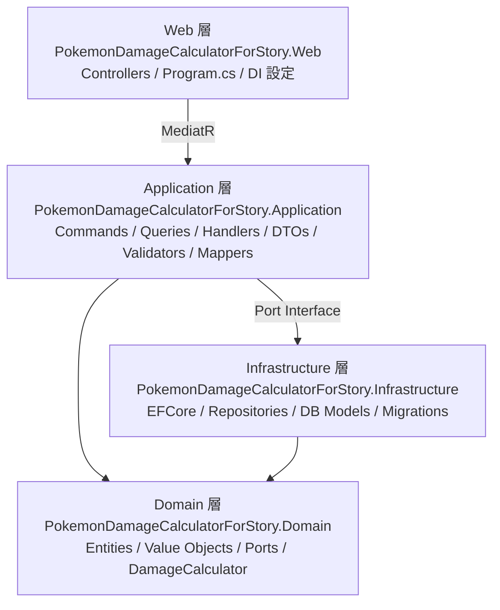
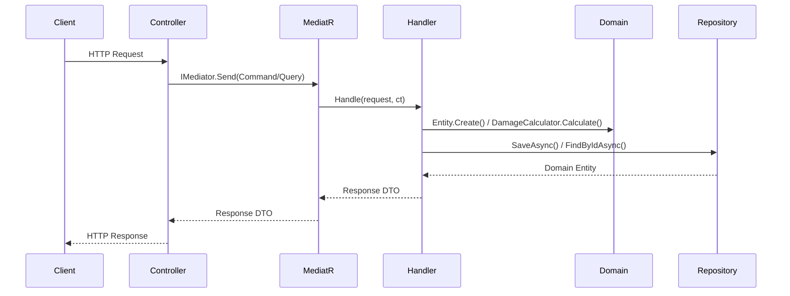

# アーキテクチャ概要

> 対象システム: ストーリー攻略用ポケモンダメージ計算 Web API
> 関連ドキュメント: [domain-model.md](./domain-model.md) | [api-reference.md](./api-reference.md) | [cqrs-handlers.md](./cqrs-handlers.md)

---

## 概要

本システムは、ポケモンのストーリー攻略を支援するダメージ計算 Web API である。
**ヘキサゴナルアーキテクチャ（ポーツ＆アダプタ）** と **DDD（ドメイン駆動設計）** を採用し、
ビジネスロジックをフレームワークから完全に分離した設計とする。

### 主要な設計方針

| 項目 | 内容 |
|------|------|
| アーキテクチャスタイル | Hexagonal Architecture（ポーツ＆アダプタ） |
| ドメイン設計 | DDD / Create-Restore パターン / private setter 必須 |
| ユースケース実装 | CQRS + MediatR（Service クラスは作らない） |
| バリデーション | FluentValidation（Application 層） |
| ランタイム | .NET 10（`net10.0`） |
| データベース | SQL Server（EFCore 10） |
| 認証 | Google Access Token（既存実装継承） |

---

## 1. レイヤー構成

### 1-1. 依存関係



依存方向: `Web → Application → Infrastructure → Domain`

Domain 層は外部フレームワークに依存しない（完全独立）。

### 1-2. 各層の責務

| 層 | 主な責務 |
|----|---------|
| **Domain** | Entity 定義・ビジネスルール・Port インターフェース・ダメージ計算ロジック |
| **Application** | CQRS Command/Query Handler・DTO・バリデーション・マッピング |
| **Infrastructure** | EFCore DbContext・Repository 実装・DB Model・Migration |
| **Web** | HTTP エンドポイント・DI 設定・認証ミドルウェア |

---

## 2. プロジェクト構成

### 2-1. モジュール一覧

| プロジェクト | 種別 | 役割 |
|------------|------|------|
| `PokemonDamageCalculatorForStory.Domain` | Class Library | ビジネスロジック中核 |
| `PokemonDamageCalculatorForStory.Application` | Class Library | ユースケース実装 |
| `PokemonDamageCalculatorForStory.Infrastructure` | Class Library | データアクセス実装 |
| `PokemonDamageCalculatorForStory.Web` | ASP.NET Core Web API | HTTP インターフェース |
| `PokemonDamageCalculatorForStory.Tests` | xUnit Test Project | ユニット・統合テスト |

### 2-2. ディレクトリ最終形

```
Domain/
├── Entities/
│   ├── RuleSet.cs
│   ├── Run.cs
│   ├── Battle.cs
│   └── CalculationResult.cs          ← 非永続 Value Object
├── ValueObjects/
│   ├── EnemyPokemonParams.cs
│   ├── AttackerParams.cs
│   ├── DefenderParams.cs
│   ├── PokemonStats.cs
│   └── PokemonEVs.cs
├── Ports/
│   ├── IRuleSetRepository.cs
│   ├── IRunRepository.cs
│   └── IBattleRepository.cs          ← OwnPokemonSnapshot も一括管理
├── DamageCalculator.cs               ← 静的クラス（外部依存ゼロ）
└── Exceptions/
    └── DomainException.cs

Application/
├── UseCases/
│   ├── Commands/                     ← 8 Command + Handler ペア
│   └── Queries/                      ← 6 Query + Handler ペア
├── DTOs/                             ← Request / Response DTO
├── Validators/                       ← 6 FluentValidation Validator
└── Mappers/                          ← Entity ↔ DTO 変換

Infrastructure/
├── Data/
│   ├── AppDbContext.cs
│   └── Models/
│       ├── PersistedRuleSet.cs
│       ├── PersistedRun.cs
│       ├── PersistedBattle.cs        ← EnemyPokemon OwnsOne
│       └── PersistedOwnPokemonSnapshot.cs  ← Stats / EVs OwnsOne
├── Repositories/
│   ├── RuleSetRepository.cs
│   ├── RunRepository.cs
│   └── BattleRepository.cs
├── Mappers/
│   ├── PersistedRuleSetMapper.cs
│   ├── PersistedRunMapper.cs
│   └── PersistedBattleMapper.cs
└── Migrations/

Web/
├── Controllers/
│   ├── RuleSetsController.cs
│   ├── RunsController.cs
│   └── BattlesController.cs
└── Authorization/
```

---

## 3. 主要設計パターン

### 3-1. CQRS + MediatR フロー



Controller は `IMediator.Send()` のみを呼び出す。ビジネスロジックは持たない。

### 3-2. Create/Restore パターン

すべての Domain Entity はコンストラクタを `private` とし、以下のファクトリメソッドのみで生成する。

| メソッド | 用途 | ビジネスルール検証 |
|---------|------|-----------------|
| `Create(...)` | 新規作成 | あり（引数を検証し DomainException を throw） |
| `Restore(...)` | DB 復元 | なし（永続化済みデータを信頼して復元） |

### 3-3. Value Object の永続化（EFCore OwnsOne）

Value Object（`EnemyPokemonParams` 等）は EFCore の `OwnsOne` を使用してフラット展開する。

```
PersistedBattle テーブルの列構成例:
  Id, RunId, Sequence,
  EnemyPokemon_Species, EnemyPokemon_Level, EnemyPokemon_Hp, ...
```

### 3-4. 所有権チェック

Run / Battle の更新・削除操作は Handler 内で所有権を確認する。

```csharp
if (run.OwnerId != request.RequestingUserId)
    throw new DomainException("この Run を操作する権限がありません");
```

---

## 4. 技術スタック

| 技術 | バージョン・用途 |
|------|--------------|
| .NET | 10.0（`net10.0`） |
| ASP.NET Core | Web API フレームワーク |
| Entity Framework Core | 10.0 / SQL Server アダプタ |
| MediatR | CQRS Mediator パターン |
| FluentValidation | Command バリデーション |
| xUnit | ユニット・統合テスト |
| Docker / docker-compose | ローカル開発・テスト DB 環境 |
