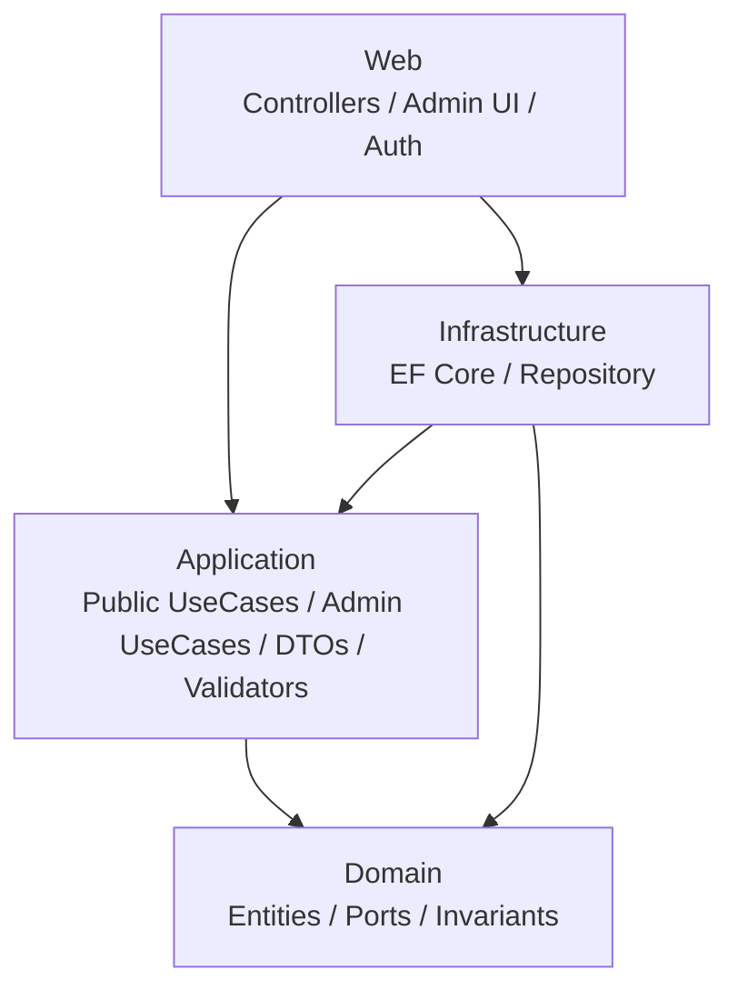
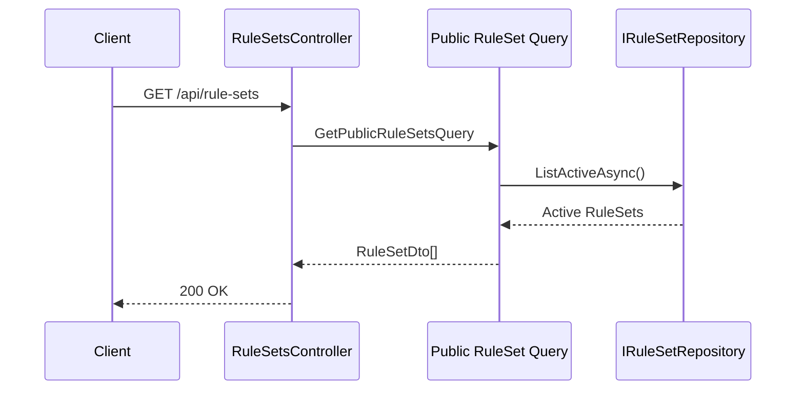
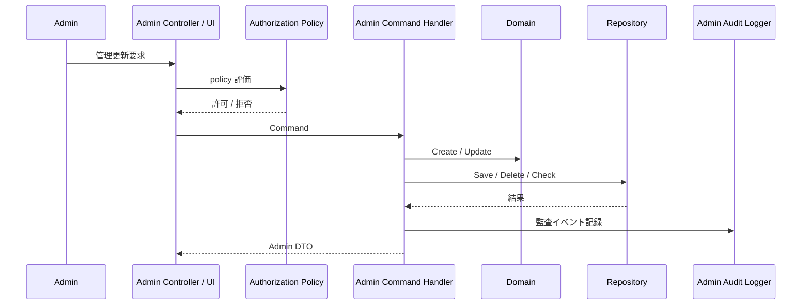

# アーキテクチャ概要

> 対象システム: ストーリー攻略用ポケモンダメージ計算 Web / 管理 UI / 管理 API
> 関連ドキュメント: [domain-model.md](./domain-model.md) | [api-reference.md](./api-reference.md) | [cqrs-handlers.md](./cqrs-handlers.md)

---

## 概要

本ドキュメントは、Phase 2 時点で合意された全体アーキテクチャを整理する。

### 主要な設計ポイント

| 項目 | 方針 |
|------|------|
| Web ホスト | 既存 `PokemonDamageCalculatorForStory.Web` に公開 API・管理 API・管理 UI を集約 |
| UI 方式 | 管理 UI は同一 Web プロジェクト内で提供する。別 SPA は作成しない |
| アプリケーション構造 | Hexagonal Architecture + CQRS + MediatR |
| 管理対象 | `RuleSet` と `UserAuthorizationInfo` |
| 認可モデル | `Administrator > MasterEditor > Member` |
| Permission Catalog | `masters.view`, `masters.rulesets.manage`, `masters.user-authorizations.manage` |
| 公開 RuleSet API | 匿名利用では `Active` のみ可視 |

---

## 1. レイヤー構成

### 1-1. 依存関係

### 1-2. 各層の責務

| 層 | 責務 |
|----|------|
| Web | 公開 API、`/api/admin/*`、管理 UI ルーティング、認証/認可ポリシー適用、監査対象リクエストの呼び出し起点 |
| Application | 公開系 Query、管理系 Command/Query、DTO、FluentValidation、派生表示項目の組み立て、admin mutation の監査イベント生成 |
| Domain | `RuleSet` / `UserAuthorizationInfo` の不変条件、Port 定義 |
| Infrastructure | CRUD、重複判定、参照中判定、最後の Administrator 判定、構造化アプリケーションログ出力、初回 seed 補助 |

---

## 2. Web プロジェクトの配置方針

### 2-1. 同一ホスト方針

- 管理 UI は既存 Web プロジェクト配下に追加する
- 管理 UI は同一ホストの `/api/admin/*` を利用する
- UI から `DbContext` や Repository を直接参照しない
- 公開 API と管理 API の責務を Controller / UseCase で分離する

### 2-2. 予定ルート

| 種別 | ルート | 用途 |
|------|--------|------|
| UI | `/admin/masters/rule-sets` | RuleSet 一覧 |
| UI | `/admin/masters/rule-sets/new` | RuleSet 新規作成 |
| UI | `/admin/masters/rule-sets/{id}` | RuleSet 詳細/編集 |
| UI | `/admin/masters/user-authorizations` | UserAuthorizationInfo 一覧 |
| UI | `/admin/masters/user-authorizations/new` | UserAuthorizationInfo 新規作成 |
| UI | `/admin/masters/user-authorizations/{googleUserId}` | UserAuthorizationInfo 詳細/編集 |

> UI 実装方式は Blazor Server を第一候補とするが、本ドキュメントでは「同一 Web プロジェクトでホストする」ことを確定事項として扱う。

---

## 3. 認証・認可

### 3-1. ロール階層

| ロール | 説明 |
|--------|------|
| `Administrator` | RuleSet 管理と UserAuthorizationInfo 管理が可能 |
| `MasterEditor` | RuleSet 管理が可能 |
| `Member` | 管理機能なし |

### 3-2. ポリシー

| Policy | 許可ロール | 対象 |
|--------|-----------|------|
| `ManageBusinessMasters` | `Administrator`, `MasterEditor` | RuleSet 管理 UI / API |
| `ManageAuthorizationMasters` | `Administrator` | UserAuthorizationInfo 管理 UI / API |

### 3-3. Permission Catalog

| Permission | 説明 | ロール整合性 |
|------------|------|--------------|
| `masters.view` | 管理 UI / 管理 API の参照系メニュー識別用 | `Administrator`, `MasterEditor`, `Member` |
| `masters.rulesets.manage` | RuleSet 管理対象の識別用 | `Administrator`, `MasterEditor` |
| `masters.user-authorizations.manage` | UserAuthorizationInfo 管理対象の識別用 | `Administrator` |

### 3-4. 適用方針

- 認可判定は Phase 2 では `UserAuthorizationInfo.Role` を基準に行う
- `Permissions[]` は保存・表示対象だが、値は catalog 内の定義済み文字列に限定する
- `Permissions[]` は role を上書きしない。role に対応する許可済み catalog の範囲内のみ保持する
- Controller / UI は policy 適用に留め、個別の role 分岐を増やさない
- 管理 UI 向けに cookie/session 認証を追加する可能性があるが、既存 bearer API は維持する

---

## 4. 公開系と管理系の分離

### 4-1. RuleSet

| 系統 | 用途 | 可視性 |
|------|------|--------|
| 公開 API | 計算用ルールセット参照 | `Active` のみ |
| 管理 API / UI | RuleSet の作成・更新・削除・詳細参照 | policy に従う |

### 4-2. UserAuthorizationInfo

| 系統 | 用途 | 可視性 |
|------|------|--------|
| 公開 API | なし |
| 管理 API / UI | ユーザー権限マスタ管理 | `Administrator` のみ |

---

## 5. 代表フロー

### 5-1. 公開 RuleSet 参照

### 5-2. 管理系更新

---

## 6. 監査ログ設計

### 6-1. 配置方針

- 対象は `/api/admin/*` のうち `POST` / `PUT` / `DELETE` の mutation API とする
- 監査ログ生成の責務は Application の admin command handler もしくは共通 service に置き、Web 層は actor/context の受け渡しに留める
- 出力は Infrastructure の `IAdminAuditLogger` 実装が担当し、Domain Entity には監査責務を持ち込まない

### 6-2. 記録ペイロード

| 項目 | 内容 |
|------|------|
| `OccurredAt` | 実行時刻 |
| `ActorUserId` | 実行ユーザーの Google User ID |
| `ActorRole` | 実行時点の role |
| `Action` | `RuleSetCreated` / `RuleSetUpdated` / `RuleSetDeleted` / `UserAuthorizationCreated` / `UserAuthorizationUpdated` / `UserAuthorizationDeleted` |
| `TargetType` | `RuleSet` または `UserAuthorizationInfo` |
| `TargetId` | `RuleSet.Id` または `GoogleUserId` |
| `Payload` | 変更後 DTO 相当の要約、削除時は削除前要約 |
| `Result` | `Succeeded` / `Rejected` |

### 6-3. 整合性メモ

- `403` の policy 拒否は既存認可で遮断されるため監査対象外とし、handler 到達後の mutation 試行のみを記録対象とする
- `409` などの業務拒否は `Result = Rejected` として構造化アプリケーションログに残し、何が拒否されたかを payload に含める
- permission は payload に含めても認可判定根拠は role のままとし、role-based model との二重管理を避ける

---

## 7. 実装上の注記

- `isReferencedByRuns` と `isLastAdministrator` は Domain Entity ではなく、Application/Infrastructure で解決する派生情報とする
- 一覧系クエリは `AsNoTracking` を基本とし、派生フラグ計算で N+1 を避ける
- `MasterEditor` 追加は string role のため schema 変更を前提としない
- 初回管理者登録は idempotent seed を想定する
- admin mutation の監査ログは統合テストで「成功時と業務拒否時の双方で記録されること」を確認する
