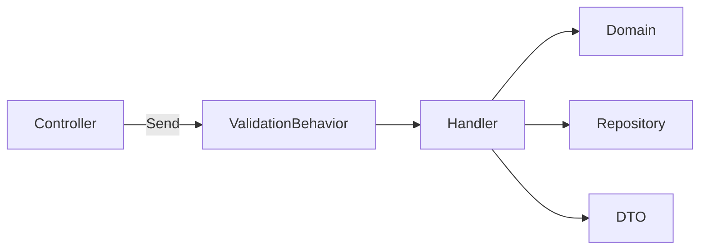

# CQRS ハンドラー設計

> 対象システム: ストーリー攻略用ポケモンダメージ計算 Application 層
> 関連ドキュメント: [architecture-overview.md](./architecture-overview.md) | [api-reference.md](./api-reference.md)

---

## 概要

本ドキュメントは、公開系と管理系を分離した CQRS 設計の骨子を整理する。

### 設計ポイント

| 項目 | 方針 |
|------|------|
| ハンドラー構成 | 公開ユースケースと管理ユースケースを分離 |
| 管理機能 | `Admin/RuleSets` と `Admin/UserAuthorizations` 単位で整理 |
| Controller | MediatR へ委譲のみ |
| Validator | 入力形式を検証し、業務不変条件は Domain へ委譲 |
| 監査ログ | admin mutation handler から共通 logger を呼び出す |

---

## 1. パイプライン



### 適用方針

- 公開 API と管理 API の双方で同じ MediatR パイプラインを利用する
- 認可は Web 層 policy で先に判定する
- Handler 内では role 分岐を基本方針にしない
- permission catalog 検証は Validator/Application で行うが、最終的な allow/deny は role-based policy を維持する

---

## 2. 公開系 Query

| Query | 役割 | 対応 API |
|-------|------|----------|
| `GetPublicRuleSetsQuery` | `Active` な RuleSet 一覧取得 | `GET /api/rule-sets` |
| `GetPublicRuleSetByIdQuery` | 匿名公開可能な RuleSet 詳細取得 | `GET /api/rule-sets/{id}` |

### 公開系の注意点

- 公開系 Query は `Status == Active` を必須条件とする
- `Draft` / `Archived` を見つけても匿名向けには `404` 扱いとする
- 管理系 Query と共有せず、可視性条件を明示的に分離する

---

## 3. 管理 RuleSet ユースケース

### Query

| Query | 役割 | 対応 API |
|-------|------|----------|
| `GetAdminRuleSetsQuery` | 全状態の一覧取得 | `GET /api/admin/rule-sets` |
| `GetAdminRuleSetByIdQuery` | 詳細取得 | `GET /api/admin/rule-sets/{id}` |

### Command

| Command | 役割 | 対応 API |
|---------|------|----------|
| `CreateRuleSetCommand` | 新規作成 | `POST /api/admin/rule-sets` |
| `UpdateRuleSetCommand` | 更新 | `PUT /api/admin/rule-sets/{id}` |
| `DeleteRuleSetCommand` | 削除 | `DELETE /api/admin/rule-sets/{id}` |

### Handler の責務

- DTO から Domain の `RuleSet` 生成/更新へ橋渡しする
- `Slug` 重複と参照中 Run の有無を repository 経由で確認する
- `AdminRuleSetDto` に `isReferencedByRuns` を付与する
- mutation handler は保存/削除後に監査ログ service へ `RuleSet*` イベントを送る

---

## 4. 管理 UserAuthorizationInfo ユースケース

### Query

| Query | 役割 | 対応 API |
|-------|------|----------|
| `GetUserAuthorizationsQuery` | 一覧取得 | `GET /api/admin/user-authorizations` |
| `GetUserAuthorizationByIdQuery` | 詳細取得 | `GET /api/admin/user-authorizations/{googleUserId}` |

### Command

| Command | 役割 | 対応 API |
|---------|------|----------|
| `CreateUserAuthorizationCommand` | 新規作成 | `POST /api/admin/user-authorizations` |
| `UpdateUserAuthorizationCommand` | 更新 | `PUT /api/admin/user-authorizations/{googleUserId}` |
| `DeleteUserAuthorizationCommand` | 削除 | `DELETE /api/admin/user-authorizations/{googleUserId}` |

### Handler の責務

- role 妥当性と permissions の正規化済み入力を Domain へ渡す
- `isLastAdministrator` を一覧/詳細 DTO に付与する
- 最後の `Administrator` の変更/削除を `409` 相当の業務エラーへ正規化する
- permission catalog (`masters.view`, `masters.rulesets.manage`, `masters.user-authorizations.manage`) との整合性を前提に処理する
- mutation handler は保存/削除後に監査ログ service へ `UserAuthorization*` イベントを送る

---

## 5. Validator 骨子

| Validator | 対象 | 主な検証 |
|-----------|------|----------|
| `CreateRuleSetCommandValidator` | RuleSet 作成 | 必須項目、status 値、generation 範囲 |
| `UpdateRuleSetCommandValidator` | RuleSet 更新 | 必須項目、status 値、generation 範囲 |
| `CreateUserAuthorizationCommandValidator` | 権限作成 | GoogleUserId、role 値、permissions null/空、catalog 値、role 整合性 |
| `UpdateUserAuthorizationCommandValidator` | 権限更新 | role 値、permissions null/空、catalog 値、role 整合性 |

> permissions 重複拒否や最後の Administrator 保護は Domain / Repository 側でも担保する。

---

## 6. 想定ファイル配置

```text
Application/
├── Authorization/
│   ├── AppRoles.cs
│   └── AppPermissions.cs
├── Auditing/
│   ├── IAdminAuditLogger.cs
│   └── AdminAuditEntry.cs
├── DTOs/
│   └── Admin/
├── UseCases/
│   ├── Public/
│   │   └── RuleSets/
│   └── Admin/
│       ├── RuleSets/
│       └── UserAuthorizations/
└── Validators/
```

---

## 7. 監査ログ設計メモ

| 項目 | 方針 |
|------|------|
| 呼び出し位置 | `Create*` / `Update*` / `Delete*` handler の保存結果確定後 |
| 入力 | actor 情報、command 名、target 識別子、変更後または削除前スナップショット、結果 |
| 失敗時 | 業務拒否 (`409` 等) は `Rejected` として記録、validation/policy で未到達のものは記録対象外 |
| 実装形態 | handler 直書きではなく共通 service または decorator 化し、後続の横断拡張を容易にする |

### 7-1. 検証メモ

- Application テストで logger 呼び出し回数と payload shape を確認する
- Web 統合テストで admin mutation 実行後に監査ログが出力されることを確認する

---

## 8. 実装注記

- 管理 UI から利用するデータも必ず Application 層の Query/Command を経由する
- `Permissions[]` は Phase 2 では認可判定に使わない
- admin mutation に監査ログ横断処理を追加しやすい構成を維持する
