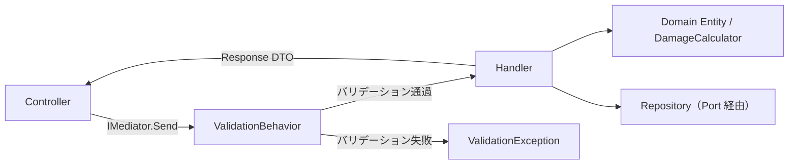

# CQRS ハンドラー設計

> 対象システム: ストーリー攻略用ポケモンダメージ計算 Web API
> 関連ドキュメント: [architecture-overview.md](./architecture-overview.md) | [api-reference.md](./api-reference.md)

---

## 概要

本ドキュメントは Application 層の CQRS 設計を定義する。
すべてのユースケースは **Command / Query + Handler** パターンで実装し、Service クラスは作らない。

### Handler 数の内訳

| 種別 | 数 |
|------|-----|
| Command Handler | 8 |
| Query Handler | 6 |
| FluentValidation Validator | 6 |

---

## 1. MediatR パイプライン



### パイプラインの構成要素

| 要素 | 役割 |
|------|------|
| Controller | `IMediator.Send()` への委譲のみ。ビジネスロジックを持たない |
| ValidationBehavior | FluentValidation によるリクエスト検証（パイプラインとして自動適用） |
| Handler | リポジトリと Domain Entity のオーケストレーション |
| Domain Entity / DamageCalculator | ビジネスルール実装 |
| Repository | Port インターフェース経由でデータアクセス |

### Controller 実装例

```csharp
[ApiController]
[Route("api/runs")]
public class RunsController(IMediator mediator) : ControllerBase
{
    [HttpPost]
    public async Task<IActionResult> Create(CreateRunRequest request)
        => Ok(await mediator.Send(new CreateRunCommand(request.Name, request.RuleSetId)));

    [HttpGet("{id}")]
    public async Task<IActionResult> GetById(Guid id)
        => Ok(await mediator.Send(new GetRunByIdQuery(id)));

    [HttpDelete("{id}")]
    public async Task<IActionResult> Delete(Guid id)
    {
        await mediator.Send(new DeleteRunCommand(id));
        return NoContent();
    }
}
```

---

## 2. Command Handler 一覧

Command はデータ変更操作（Create / Update / Delete）を担う。

| Command | Handler | 対応エンドポイント | DB 書き込み |
|---------|---------|-----------------|------------|
| `CreateRunCommand` | `CreateRunCommandHandler` | `POST /api/runs` | あり |
| `UpdateRunCommand` | `UpdateRunCommandHandler` | `PUT /api/runs/{id}` | あり |
| `DeleteRunCommand` | `DeleteRunCommandHandler` | `DELETE /api/runs/{id}` | あり |
| `CreateBattleCommand` | `CreateBattleCommandHandler` | `POST /api/runs/{runId}/battles` | あり |
| `UpdateBattleCommand` | `UpdateBattleCommandHandler` | `PUT /api/runs/{runId}/battles/{id}` | あり |
| `DeleteBattleCommand` | `DeleteBattleCommandHandler` | `DELETE /api/runs/{runId}/battles/{id}` | あり |
| `CalculateDamageCommand` | `CalculateDamageCommandHandler` | `POST /api/runs/{runId}/battles/{id}/calculate` | **なし**（純粋計算） |
| `AddProgressionEventCommand` | `AddProgressionEventCommandHandler` | `POST /api/runs/{runId}/party-state` | あり |

### CalculateDamageCommandHandler の特記事項

`CalculateDamageCommandHandler` は Repository へのアクセスを行わない。入力パラメータのみで `DamageCalculator.Calculate()` を呼び出し、結果を返す。

```csharp
public class CalculateDamageCommandHandler : IRequestHandler<CalculateDamageCommand, CalculateDamageResponse>
{
    public Task<CalculateDamageResponse> Handle(CalculateDamageCommand request, CancellationToken ct)
    {
        var result = DamageCalculator.Calculate(request.Attacker, request.Defender);
        return Task.FromResult(new CalculateDamageResponse { Success = true, Data = result.ToDto() });
    }
}
```

### 所有権チェックを伴う Handler

`UpdateRunCommand` / `DeleteRunCommand` は Handler 内で所有権を確認する。

```csharp
var run = await _runRepository.FindByIdAsync(request.RunId, ct)
    ?? throw new DomainException("Run が見つかりません");

if (run.OwnerId != request.RequestingUserId)
    throw new DomainException("この Run を操作する権限がありません");
```

---

## 3. Query Handler 一覧

Query は読み取り操作を担う。副作用なし（idempotent）。

| Query | Handler | 対応エンドポイント |
|-------|---------|-----------------|
| `GetAllRuleSetsQuery` | `GetAllRuleSetsQueryHandler` | `GET /api/rule-sets` |
| `GetRuleSetByIdQuery` | `GetRuleSetByIdQueryHandler` | `GET /api/rule-sets/{id}` |
| `GetAllRunsQuery` | `GetAllRunsQueryHandler` | `GET /api/runs` |
| `GetRunByIdQuery` | `GetRunByIdQueryHandler` | `GET /api/runs/{id}` |
| `GetBattlesByRunQuery` | `GetBattlesByRunQueryHandler` | `GET /api/runs/{runId}/battles` |
| `ProjectPartyStateQuery` | `ProjectPartyStateQueryHandler` | `GET /api/runs/{runId}/party-state` |

---

## 4. FluentValidation

### 適用 Validator 一覧

形式的な入力検証（null/空白・範囲チェック）を担当する。ビジネスルール検証は Domain Entity に委譲する。

| Validator | 検証対象 Command | 主な検証項目 |
|-----------|----------------|------------|
| `CreateRunCommandValidator` | `CreateRunCommand` | Name 必須・256 文字以内、RuleSetId 非空 Guid |
| `UpdateRunCommandValidator` | `UpdateRunCommand` | Name 必須、Status 有効値（Active / Completed / Archived） |
| `CreateBattleCommandValidator` | `CreateBattleCommand` | Sequence ≥ 1、EnemyPokemon 各値必須・範囲チェック |
| `UpdateBattleCommandValidator` | `UpdateBattleCommand` | Sequence ≥ 1、EnemyPokemon 各値必須・範囲チェック |
| `CalculateDamageCommandValidator` | `CalculateDamageCommand` | Level 1-100、Attack/Defense ≥ 1、MovePower ≥ 1、MoveCategory 有効値、TypeEffectiveness 有効倍率 |
| `AddProgressionEventCommandValidator` | `AddProgressionEventCommand` | PokemonId 必須、EventType 有効値 |

### ValidationBehavior の適用方針

MediatR の `IPipelineBehavior<TRequest, TResponse>` として `ValidationBehavior` を実装し、すべての Command に対して自動適用する。バリデーション失敗時は `ValidationException` を throw する（Controller は `ProblemDetails` 形式で返却）。

---

## 5. Application 層ファイル構成

```
Application/
├── UseCases/
│   ├── Commands/
│   │   ├── CreateRunCommand.cs
│   │   ├── CreateRunCommandHandler.cs
│   │   ├── UpdateRunCommand.cs
│   │   ├── UpdateRunCommandHandler.cs
│   │   ├── DeleteRunCommand.cs
│   │   ├── DeleteRunCommandHandler.cs
│   │   ├── CreateBattleCommand.cs
│   │   ├── CreateBattleCommandHandler.cs
│   │   ├── UpdateBattleCommand.cs
│   │   ├── UpdateBattleCommandHandler.cs
│   │   ├── DeleteBattleCommand.cs
│   │   ├── DeleteBattleCommandHandler.cs
│   │   ├── CalculateDamageCommand.cs
│   │   ├── CalculateDamageCommandHandler.cs
│   │   ├── AddProgressionEventCommand.cs
│   │   └── AddProgressionEventCommandHandler.cs
│   └── Queries/
│       ├── GetAllRuleSetsQuery.cs
│       ├── GetAllRuleSetsQueryHandler.cs
│       ├── GetRuleSetByIdQuery.cs
│       ├── GetRuleSetByIdQueryHandler.cs
│       ├── GetAllRunsQuery.cs
│       ├── GetAllRunsQueryHandler.cs
│       ├── GetRunByIdQuery.cs
│       ├── GetRunByIdQueryHandler.cs
│       ├── GetBattlesByRunQuery.cs
│       ├── GetBattlesByRunQueryHandler.cs
│       ├── ProjectPartyStateQuery.cs
│       └── ProjectPartyStateQueryHandler.cs
├── DTOs/
│   ├── EnemyPokemonParamsDto.cs
│   ├── AttackerParamsDto.cs
│   ├── DefenderParamsDto.cs
│   ├── RuleSetResponseDto.cs
│   ├── CreateRunRequest.cs
│   ├── UpdateRunRequest.cs
│   ├── RunResponseDto.cs
│   ├── CreateBattleRequest.cs
│   ├── UpdateBattleRequest.cs
│   ├── BattleResponseDto.cs
│   ├── CalculateDamageRequest.cs
│   ├── CalculateDamageResponseDto.cs
│   ├── AddProgressionEventRequest.cs
│   └── PartyStateResponseDto.cs
├── Validators/
│   ├── CreateRunCommandValidator.cs
│   ├── UpdateRunCommandValidator.cs
│   ├── CreateBattleCommandValidator.cs
│   ├── UpdateBattleCommandValidator.cs
│   ├── CalculateDamageCommandValidator.cs
│   └── AddProgressionEventCommandValidator.cs
└── Mappers/
    ├── RuleSetMapper.cs
    ├── RunMapper.cs
    ├── BattleMapper.cs
    └── CalculationResultMapper.cs
```
