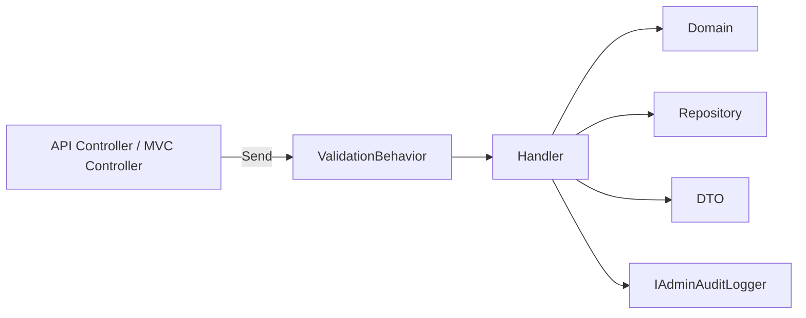

# CQRS ハンドラー設計

> 対象システム: ストーリー攻略用ポケモンダメージ計算 Application 層
> 関連ドキュメント: [architecture-overview.md](./architecture-overview.md) | [api-reference.md](./api-reference.md)

---

## 概要

本ドキュメントは、実装済みの公開系と管理系の CQRS 構成を整理する。

### 設計ポイント

| 項目 | 方針 |
|------|------|
| ハンドラー構成 | 公開ユースケースと管理ユースケースを分離 |
| 管理機能 | `Admin/RuleSets` と `Admin/UserAuthorizations` 単位で整理 |
| Web 層 | API Controller と MVC Controller の両方が MediatR に委譲 |
| Validator | 入力形式・catalog 値・重複を検証し、業務不変条件は Domain / Repository へ委譲 |
| 監査ログ | admin mutation handler から `IAdminAuditLogger` を呼び出す |

---

## 1. パイプライン



### 適用方針

- 公開 API、管理 API、管理 UI の双方で同じ MediatR パイプラインを利用する
- 認可は Web 層 policy で先に判定する
- Handler 内では role 分岐を行わず、actor 情報は監査ログ用に受け取る
- permission catalog 検証は Validator で行うが、最終的な allow/deny は role-based policy を維持する

---

## 2. 公開系 Query

| Query | 役割 | 対応 API |
|-------|------|----------|
| `GetAllRuleSetsQuery` | `Active` な RuleSet 一覧取得 | `GET /api/rule-sets` |
| `GetRuleSetByIdQuery` | 匿名公開可能な RuleSet 詳細取得 | `GET /api/rule-sets/{id}` |

### 公開系の注意点

- 公開系 Query は repository の `FindAllActiveAsync` / `FindActiveByIdAsync` を使う
- `Draft` / `Archived` は匿名向けには `404` 扱いとする
- 管理系 Query と共有せず、可視性条件を明示的に分離する

---

## 3. 管理 RuleSet ユースケース

### Query

| Query | 役割 | 対応 API / UI |
|-------|------|---------------|
| `GetAdminRuleSetsQuery` | 全状態の一覧取得 | `GET /api/admin/rule-sets` / `/admin/masters/rule-sets` |
| `GetAdminRuleSetByIdQuery` | 詳細取得 | `GET /api/admin/rule-sets/{id}` / `/admin/masters/rule-sets/{id}` |

### Command

| Command | 役割 | 対応 API / UI |
|---------|------|---------------|
| `CreateAdminRuleSetCommand` | 新規作成 | `POST /api/admin/rule-sets` / `POST /admin/masters/rule-sets/new` |
| `UpdateAdminRuleSetCommand` | 更新 | `PUT /api/admin/rule-sets/{id}` / `POST /admin/masters/rule-sets/{id}` |
| `DeleteAdminRuleSetCommand` | 削除 | `DELETE /api/admin/rule-sets/{id}` / `POST /admin/masters/rule-sets/{id}/delete` |

### Handler の責務

- DTO から Domain の `RuleSet` 生成/更新へ橋渡しする
- `Slug` 重複と参照中 Run の有無を repository 経由で確認する
- 一覧 DTO の `isReferencedByRuns` は `FindReferencedRuleSetIdsAsync()` でまとめて計算する
- mutation handler は `Create` / `Update` / `Delete` の監査ログを記録する

---

## 4. 管理 UserAuthorizationInfo ユースケース

### Query

| Query | 役割 | 対応 API / UI |
|-------|------|---------------|
| `GetAdminUserAuthorizationsQuery` | 一覧取得 | `GET /api/admin/user-authorizations` / `/admin/masters/user-authorizations` |
| `GetAdminUserAuthorizationByIdQuery` | 詳細取得 | `GET /api/admin/user-authorizations/{googleUserId}` / `/admin/masters/user-authorizations/{googleUserId}` |

### Command

| Command | 役割 | 対応 API / UI |
|---------|------|---------------|
| `CreateAdminUserAuthorizationCommand` | 新規作成 | `POST /api/admin/user-authorizations` / `POST /admin/masters/user-authorizations/new` |
| `UpdateAdminUserAuthorizationCommand` | 更新 | `PUT /api/admin/user-authorizations/{googleUserId}` / `POST /admin/masters/user-authorizations/{googleUserId}` |
| `DeleteAdminUserAuthorizationCommand` | 削除 | `DELETE /api/admin/user-authorizations/{googleUserId}` / `POST /admin/masters/user-authorizations/{googleUserId}/delete` |

### Handler の責務

- role と permissions を Domain へ渡す
- `isLastAdministrator` は `CountByRoleAsync(AppRoles.Administrator)` の結果から組み立てる
- 最後の `Administrator` の role 変更/削除を `409` 相当の業務エラーへ正規化する
- `permissions` は catalog 値として扱うが、role ごとの部分集合制約は handler では持たない
- mutation handler は `Create` / `Update` / `Delete` の監査ログを記録する

---

## 5. Validator

| Validator | 対象 | 主な検証 |
|-----------|------|----------|
| `CreateAdminRuleSetCommandValidator` | RuleSet 作成 | 必須項目、slug 形式、status 値、generation 範囲、長さ制約 |
| `UpdateAdminRuleSetCommandValidator` | RuleSet 更新 | `Id`、必須項目、slug 形式、status 値、generation 範囲、長さ制約 |
| `CreateAdminUserAuthorizationCommandValidator` | 権限作成 | GoogleUserId、role 値、permissions null、catalog 値、重複拒否 |
| `UpdateAdminUserAuthorizationCommandValidator` | 権限更新 | GoogleUserId、role 値、permissions null、catalog 値、重複拒否 |

> 最後の Administrator 保護や slug 重複は handler / repository 側で担保する。

---

## 6. 想定ファイル配置

```text
Application/
├── Auditing/
│   ├── AdminAuditEntry.cs
│   └── IAdminAuditLogger.cs
├── Authorization/
│   ├── AppPermissions.cs
│   └── AppRoles.cs
├── DTOs/
│   ├── RuleSetDto.cs
│   └── Admin/
├── UseCases/
│   ├── Queries/
│   │   ├── GetAllRuleSetsQuery.cs
│   │   └── GetRuleSetByIdQuery.cs
│   └── Admin/
│       ├── RuleSets/
│       └── UserAuthorizations/
└── Validators/
```

---

## 7. 監査ログ設計メモ

| 項目 | 方針 |
|------|------|
| 呼び出し位置 | `Create*` / `Update*` / `Delete*` handler の保存結果確定後 |
| 入力 | actor 情報、`Operation`、`TargetType`、`TargetId`、変更要求要約、結果 |
| 失敗時 | 業務拒否 (`409` 等) は `Rejected` として記録、validation/policy で未到達のものは記録対象外 |
| 実装形態 | handler から `IAdminAuditLogger` を呼び、Infrastructure で構造化ログへ出力 |

### 7-1. 検証メモ

- Web 統合テストで admin mutation 実行後の監査記録有無を確認する
- 監査ログは API と MVC の共通 handler により一元化される

---

## 8. 実装注記

- 管理 UI から利用するデータも必ず Application 層の Query/Command を経由する
- `Permissions[]` は認可判定に使わない
- admin mutation に監査ログ横断処理を追加しやすい構成を維持する
