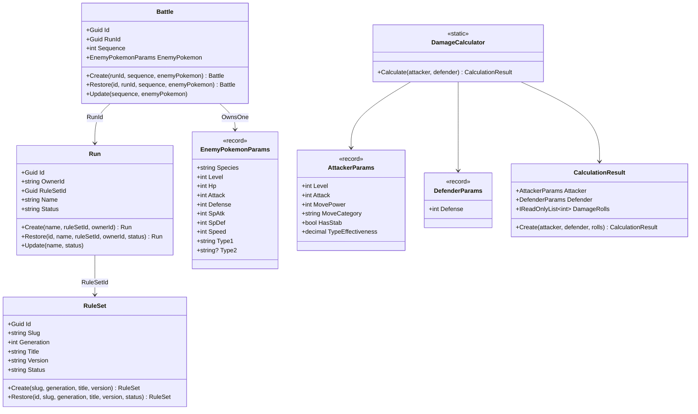

# ドメインモデル設計

> 対象システム: ストーリー攻略用ポケモンダメージ計算 Web API
> 関連ドキュメント: [architecture-overview.md](./architecture-overview.md) | [api-reference.md](./api-reference.md)

---

## 概要

本ドキュメントは Domain 層の設計を定義する。
すべての Entity は **Create/Restore パターン** と **private setter** を採用し、ビジネスルールを Entity 内にカプセル化する。

### Domain 層の構成要素

| 種別 | クラス |
|------|------|
| Entity | `RuleSet`, `Run`, `Battle` |
| Value Object（非永続） | `CalculationResult` |
| Value Object（record） | `EnemyPokemonParams`, `AttackerParams`, `DefenderParams`, `PokemonStats`, `PokemonEVs` |
| Port（インターフェース） | `IRuleSetRepository`, `IRunRepository`, `IBattleRepository` |
| ドメインサービス | `DamageCalculator`（静的クラス） |

---

## 1. Create/Restore パターン

すべての Entity に共通する実装パターンを以下に示す。

```csharp
public sealed class Run
{
    public Guid Id { get; private set; }
    public string Name { get; private set; } = default!;
    public Guid RuleSetId { get; private set; }
    public string OwnerId { get; private set; } = default!;
    public string Status { get; private set; } = default!;

    private Run() { }  // EFCore 用プライベートコンストラクタ

    // 新規作成：ビジネスルール検証あり
    public static Run Create(string name, Guid ruleSetId, string ownerId) { ... }

    // DB 復元：検証なし（永続化済みデータを信頼）
    public static Run Restore(Guid id, string name, Guid ruleSetId, string ownerId, string status) { ... }
}
```

| メソッド | 用途 | ビジネスルール検証 |
|---------|------|-----------------|
| `Create(...)` | 新規作成 | あり（DomainException を throw） |
| `Restore(...)` | DB からの復元 | なし |

---

## 2. Entity 一覧

### 2-1. RuleSet

世代別ダメージ計算ルールを管理する。シードデータとして管理し、API 経由の作成・更新・削除はしない。

| プロパティ | 型 | 説明 | ビジネスルール |
|-----------|-----|------|-------------|
| `Id` | `Guid` | 主キー | — |
| `Slug` | `string` | URL-friendly 識別子（例: `gen6-base`） | 空白禁止・URL-safe 形式 |
| `Generation` | `int` | 世代番号 | 3 以上 |
| `Title` | `string` | 表示名 | 空白禁止 |
| `Version` | `string` | バージョン文字列 | 空白禁止 |
| `Status` | `string` | 有効状態 | `Active` / `Inactive` |

```csharp
public sealed class RuleSet
{
    public Guid Id { get; private set; }
    public string Slug { get; private set; } = default!;
    public int Generation { get; private set; }
    public string Title { get; private set; } = default!;
    public string Version { get; private set; } = default!;
    public string Status { get; private set; } = default!;

    private RuleSet() { }

    public static RuleSet Create(string slug, int generation, string title, string version) { ... }
    public static RuleSet Restore(Guid id, string slug, int generation, string title, string version, string status) { ... }
}
```

### 2-2. Run

ユーザーの攻略計画単位。認証ユーザー（OwnerId）に紐付く。

| プロパティ | 型 | 説明 | ビジネスルール |
|-----------|-----|------|-------------|
| `Id` | `Guid` | 主キー | — |
| `OwnerId` | `string` | Google User ID | 空白禁止 |
| `RuleSetId` | `Guid` | 参照する RuleSet | 空 Guid 禁止 |
| `Name` | `string` | Run 名称 | 空白禁止 |
| `Status` | `string` | 状態 | `Active` / `Completed` / `Archived` |

```csharp
public sealed class Run
{
    public Guid Id { get; private set; }
    public string OwnerId { get; private set; } = default!;
    public Guid RuleSetId { get; private set; }
    public string Name { get; private set; } = default!;
    public string Status { get; private set; } = default!;

    private Run() { }

    public static Run Create(string name, Guid ruleSetId, string ownerId) { ... }
    public static Run Restore(Guid id, string name, Guid ruleSetId, string ownerId, string status) { ... }
    public void Update(string name, string status) { ... }
}
```

### 2-3. Battle

Run 内の個別戦闘記録。相手ポケモンのパラメータを `EnemyPokemonParams`（Value Object）として保持する。

| プロパティ | 型 | 説明 | ビジネスルール |
|-----------|-----|------|-------------|
| `Id` | `Guid` | 主キー | — |
| `RunId` | `Guid` | 所属する Run | 空 Guid 禁止 |
| `Sequence` | `int` | 戦闘順序 | 1 以上 |
| `EnemyPokemon` | `EnemyPokemonParams` | 相手ポケモンパラメータ | Value Object（次節参照） |

```csharp
public sealed class Battle
{
    public Guid Id { get; private set; }
    public Guid RunId { get; private set; }
    public int Sequence { get; private set; }
    public EnemyPokemonParams EnemyPokemon { get; private set; } = default!;

    private Battle() { }

    public static Battle Create(Guid runId, int sequence, EnemyPokemonParams enemyPokemon) { ... }
    public static Battle Restore(Guid id, Guid runId, int sequence, EnemyPokemonParams enemyPokemon) { ... }
    public void Update(int sequence, EnemyPokemonParams enemyPokemon) { ... }
}
```

### 2-4. CalculationResult（非永続 Value Object）

ダメージ計算の結果を保持する。DB への書き込みは行わない。

| プロパティ | 型 | 説明 |
|-----------|-----|------|
| `Attacker` | `AttackerParams` | 攻撃側パラメータ |
| `Defender` | `DefenderParams` | 防御側パラメータ |
| `DamageRolls` | `IReadOnlyList<int>` | ダメージ16段階（`[0]`=最小, `[15]`=最大） |

---

## 3. Value Object 一覧

C# `record` で実装する。イミュータブルで等価性は値で比較する。

### 3-1. EnemyPokemonParams

相手ポケモンの種族値・タイプ情報を保持する。`PersistedBattle` テーブルに `OwnsOne` でフラット展開する。

```csharp
public record EnemyPokemonParams(
    string Species,       // 種族名
    int Level,
    int Hp,
    int Attack,
    int Defense,
    int SpAtk,
    int SpDef,
    int Speed,
    string Type1,         // タイプ1
    string? Type2         // タイプ2（nullable）
);
```

### 3-2. AttackerParams

ダメージ計算の攻撃側入力パラメータ。

```csharp
public record AttackerParams(
    int Level,
    int Attack,              // 物理攻撃 or 特殊攻撃の実数値
    int MovePower,           // 技の威力
    string MoveCategory,     // "Physical" or "Special"
    bool HasStab,            // STAB 有無
    decimal TypeEffectiveness  // タイプ相性倍率（0, 0.25, 0.5, 1, 2, 4）
);
```

### 3-3. DefenderParams

ダメージ計算の防御側入力パラメータ。

```csharp
public record DefenderParams(
    int Defense    // 物理防御 or 特殊防御の実数値
);
```

### 3-4. PokemonStats・PokemonEVs

`OwnPokemonSnapshot` の実数値・努力値を保持する。`PersistedOwnPokemonSnapshot` テーブルに `OwnsOne` でフラット展開する。

```csharp
public record PokemonStats(int Hp, int Attack, int Defense, int SpAtk, int SpDef, int Speed);
public record PokemonEVs(int Hp, int Attack, int Defense, int SpAtk, int SpDef, int Speed);
```

---

## 4. Domain Ports（インターフェース）

```csharp
// Domain/Ports/IRuleSetRepository.cs
public interface IRuleSetRepository
{
    Task<IReadOnlyList<RuleSet>> GetAllAsync(CancellationToken ct);
    Task<RuleSet?> FindByIdAsync(Guid id, CancellationToken ct);
    Task<RuleSet?> FindBySlugAsync(string slug, CancellationToken ct);
}

// Domain/Ports/IRunRepository.cs
public interface IRunRepository
{
    Task<IReadOnlyList<Run>> GetAllByOwnerIdAsync(string ownerId, CancellationToken ct);
    Task<Run?> FindByIdAsync(Guid id, CancellationToken ct);
    Task<Run> SaveAsync(Run run, CancellationToken ct);
    Task DeleteAsync(Guid id, CancellationToken ct);
}

// Domain/Ports/IBattleRepository.cs
// OwnPokemonSnapshot は Battle と同一 Repository で一括管理する
public interface IBattleRepository
{
    Task<IReadOnlyList<Battle>> GetAllByRunIdAsync(Guid runId, CancellationToken ct);
    Task<Battle?> FindByIdAsync(Guid id, CancellationToken ct);
    Task<Battle> SaveAsync(Battle battle, CancellationToken ct);
    Task DeleteAsync(Guid id, CancellationToken ct);
}
```

> `OwnPokemonSnapshot` は独立した Port を設けず、`IBattleRepository` で一括管理する。

---

## 5. ダメージ計算式

### 5-1. 計算式（第3世代以降共通式、第6世代基準）

```
BaseDamage = Floor( Floor( Floor(2 * Level / 5 + 2) * Power * A / D ) / 50 ) + 2
Damage(roll) = Floor( BaseDamage * Modifier(roll) )

Modifier(roll) = STAB * TypeEffectiveness * (RandomFactor[roll] / 100)
RandomFactor   = { 85, 86, 87, 88, 89, 90, 91, 92, 93, 94, 95, 96, 97, 98, 99, 100 }
STAB           = HasStab ? 1.5 : 1.0
```

| 変数 | 説明 |
|------|------|
| `Level` | 攻撃側レベル |
| `Power` | 技の威力（`MovePower`） |
| `A` | 物理 or 特殊攻撃の実数値（`MoveCategory` で切り替え） |
| `D` | 物理 or 特殊防御の実数値（`MoveCategory` で切り替え） |
| `TypeEffectiveness` | タイプ相性倍率（`0, 0.25, 0.5, 1.0, 2.0, 4.0`） |

### 5-2. 実装方針

- `DamageCalculator` は Domain 層の**静的クラス**として実装する（外部依存ゼロ）
- 乱数生成器は使用しない。固定配列 `{ 85..100 }` で16段階すべてを**決定的に**計算する
- `DamageRolls[0]` = 最小ダメージ（85/100）、`DamageRolls[15]` = 最大ダメージ（100/100）

```csharp
// Domain/DamageCalculator.cs
public static class DamageCalculator
{
    private static readonly int[] RandomFactors =
        { 85, 86, 87, 88, 89, 90, 91, 92, 93, 94, 95, 96, 97, 98, 99, 100 };

    public static CalculationResult Calculate(AttackerParams attacker, DefenderParams defender)
    {
        int baseDamage = CalcBase(attacker.Level, attacker.MovePower, attacker.Attack, defender.Defense);
        var rolls = RandomFactors
            .Select(r => ApplyModifier(baseDamage, attacker.HasStab, attacker.TypeEffectiveness, r))
            .ToArray();
        return CalculationResult.Create(attacker, defender, rolls);
    }

    private static int CalcBase(int level, int power, int attack, int defense)
        => (int)Math.Floor((double)(
              (int)Math.Floor((double)((int)Math.Floor(2.0 * level / 5 + 2) * power * attack) / defense)
           ) / 50) + 2;

    private static int ApplyModifier(int baseDamage, bool hasStab, decimal typeEff, int randomFactor)
    {
        double stab = hasStab ? 1.5 : 1.0;
        return (int)Math.Floor(baseDamage * stab * (double)typeEff * randomFactor / 100.0);
    }
}
```

---

## 6. クラス関係図


