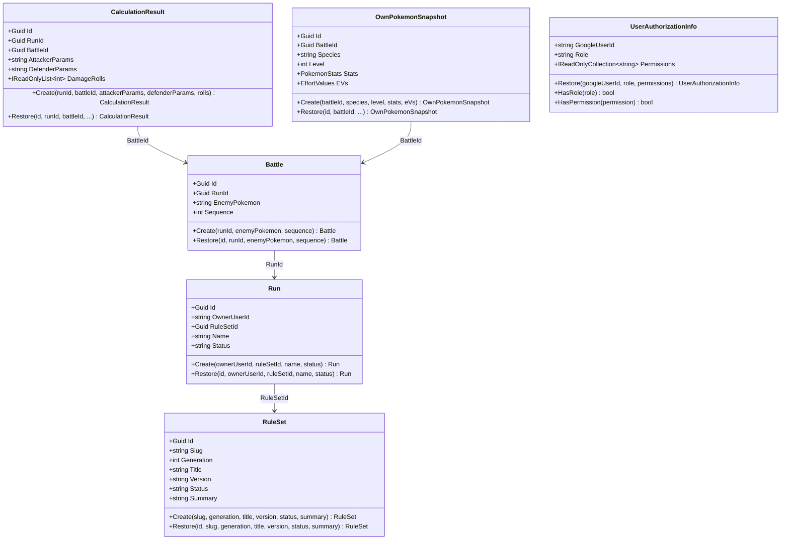

# ドメインモデル設計

> 対象システム: ストーリー攻略用ポケモンダメージ計算 Web API
> 関連ドキュメント: [architecture-overview.md](./architecture-overview.md) | [api-reference.md](./api-reference.md)

---

## 概要

本ドキュメントは Domain 層の設計を定義する。
すべての Entity は **Create/Restore パターン** と **private setter** を採用し、ビジネスルールを Entity 内にカプセル化する。

### Domain 層の構成要素

| 種別 | クラス |
|------|------|
| Entity | `RuleSet`, `Run`, `Battle`, `CalculationResult`, `OwnPokemonSnapshot`, `UserAuthorizationInfo` |
| Port（インターフェース） | `IRuleSetRepository`, `IRunRepository`, `IBattleRepository`, `IUserAuthorizationInfoRepository` |
| 例外 | `DomainException`, `NotFoundException`, `ValidationException` |

> **設計注記**: Value Object（`EnemyPokemonParams`, `AttackerParams` 等）は Domain 層には存在しない。  
> EnemyPokemon などの複合パラメータは JSON シリアライズされた `string` として Entity に保持し、DTO レイヤで構造化する。  
> ダメージ計算ロジックは Domain の静的クラスではなく Application 層の `CalculateDamageCommandHandler` に実装されている。

---

## 1. Create/Restore パターン

すべての Entity に共通する実装パターンを以下に示す。

```csharp
public sealed class Run
{
    public Guid Id { get; private set; }
    public string OwnerUserId { get; private set; } = string.Empty;
    public Guid RuleSetId { get; private set; }
    public string Name { get; private set; } = string.Empty;
    public string Status { get; private set; } = string.Empty;

    private Run() { }  // EFCore 用プライベートコンストラクタ

    // 新規作成：ビジネスルール検証あり（ValidationException を throw）
    public static Run Create(string ownerUserId, Guid ruleSetId, string name, string status) { ... }

    // DB 復元：検証なし（永続化済みデータを信頼）
    public static Run Restore(Guid id, string ownerUserId, Guid ruleSetId, string name, string status) { ... }
}
```

| メソッド | 用途 | ビジネスルール検証 |
|---------|------|-----------------|
| `Create(...)` | 新規作成 | あり（`ValidationException` を throw） |
| `Restore(...)` | DB からの復元 | なし |

---

## 2. Entity 一覧

### 2-1. RuleSet

世代別ダメージ計算ルールを管理する。シードデータとして管理し、API 経由の作成・更新・削除はしない。

| プロパティ | 型 | 説明 | ビジネスルール |
|-----------|-----|------|-------------|
| `Id` | `Guid` | 主キー | — |
| `Slug` | `string` | URL-friendly 識別子（例: `gen6-standard`） | 空白禁止 |
| `Generation` | `int` | 世代番号 | 1 以上 |
| `Title` | `string` | 表示名 | 空白禁止 |
| `Version` | `string` | バージョン文字列 | 空白禁止 |
| `Status` | `string` | 有効状態 | 空白禁止 |
| `Summary` | `string` | 概要テキスト | — |

```csharp
public sealed class RuleSet
{
    public Guid Id { get; private set; }
    public string Slug { get; private set; } = string.Empty;
    public int Generation { get; private set; }
    public string Title { get; private set; } = string.Empty;
    public string Version { get; private set; } = string.Empty;
    public string Status { get; private set; } = string.Empty;
    public string Summary { get; private set; } = string.Empty;

    private RuleSet() { }

    public static RuleSet Create(string slug, int generation, string title, string version, string status, string summary) { ... }
    public static RuleSet Restore(Guid id, string slug, int generation, string title, string version, string status, string summary) { ... }
}
```

### 2-2. Run

ユーザーの攻略計画単位。認証ユーザー（OwnerUserId）に紐付く。

| プロパティ | 型 | 説明 | ビジネスルール |
|-----------|-----|------|-------------|
| `Id` | `Guid` | 主キー | — |
| `OwnerUserId` | `string` | Google User ID | 空白禁止 |
| `RuleSetId` | `Guid` | 参照する RuleSet | 空 Guid 禁止 |
| `Name` | `string` | Run 名称 | 空白禁止・200 文字以内 |
| `Status` | `string` | 状態 | 空白禁止 |

```csharp
public sealed class Run
{
    public Guid Id { get; private set; }
    public string OwnerUserId { get; private set; } = string.Empty;
    public Guid RuleSetId { get; private set; }
    public string Name { get; private set; } = string.Empty;
    public string Status { get; private set; } = string.Empty;

    private Run() { }

    public static Run Create(string ownerUserId, Guid ruleSetId, string name, string status) { ... }
    public static Run Restore(Guid id, string ownerUserId, Guid ruleSetId, string name, string status) { ... }
}
```

### 2-3. Battle

Run 内の個別戦闘記録。相手ポケモンのパラメータを JSON 文字列（`EnemyPokemon`）として保持する。

| プロパティ | 型 | 説明 | ビジネスルール |
|-----------|-----|------|-------------|
| `Id` | `Guid` | 主キー | — |
| `RunId` | `Guid` | 所属する Run | 空 Guid 禁止 |
| `Sequence` | `int` | 戦闘順序 | 1 以上 |
| `EnemyPokemon` | `string` | 相手ポケモンパラメータ（JSON） | 空白禁止 |

```csharp
public sealed class Battle
{
    public Guid Id { get; private set; }
    public Guid RunId { get; private set; }
    public string EnemyPokemon { get; private set; } = string.Empty;
    public int Sequence { get; private set; }

    private Battle() { }

    public static Battle Create(Guid runId, string enemyPokemon, int sequence) { ... }
    public static Battle Restore(Guid id, Guid runId, string enemyPokemon, int sequence) { ... }
}
```

### 2-4. CalculationResult（永続 Entity）

ダメージ計算の結果を保持する。DB に保存される（`PersistedCalculationResult` テーブル）。

| プロパティ | 型 | 説明 |
|-----------|-----|------|
| `Id` | `Guid` | 主キー |
| `RunId` | `Guid` | 実行 Run |
| `BattleId` | `Guid` | 対象 Battle |
| `AttackerParams` | `string` | 攻撃側パラメータ（JSON 文字列） |
| `DefenderParams` | `string` | 防御側パラメータ（JSON 文字列） |
| `DamageRolls` | `IReadOnlyList<int>` | ダメージ16段階（`[0]`=最小, `[15]`=最大） |

```csharp
public sealed class CalculationResult
{
    public Guid Id { get; private set; }
    public Guid RunId { get; private set; }
    public Guid BattleId { get; private set; }
    public string AttackerParams { get; private set; } = string.Empty;
    public string DefenderParams { get; private set; } = string.Empty;
    public IReadOnlyList<int> DamageRolls { get; private set; } = Array.Empty<int>();

    private CalculationResult() { }

    public static CalculationResult Create(Guid runId, Guid battleId, string attackerParams, string defenderParams, IReadOnlyList<int> damageRolls) { ... }
    public static CalculationResult Restore(Guid id, Guid runId, Guid battleId, string attackerParams, string defenderParams, IReadOnlyList<int> damageRolls) { ... }
}
```

### 2-5. OwnPokemonSnapshot

パーティ進捗イベントを記録する。特定の Battle 時点での自分のポケモン状態を保持する。

| プロパティ | 型 | 説明 | ビジネスルール |
|-----------|-----|------|-------------|
| `Id` | `Guid` | 主キー | — |
| `BattleId` | `Guid` | 対応する Battle | 空 Guid 禁止 |
| `Species` | `string` | ポケモン種族名 | 空白禁止・100 文字以内 |
| `Level` | `int` | レベル | 1〜100 |
| `Stats` | `PokemonStats` | 実数値（HP/攻撃/防御/特攻/特防/素早さ） | 全 6 項目必須・各値 1 以上 |
| `EVs` | `EffortValues` | 努力値（HP/攻撃/防御/特攻/特防/素早さ） | 全 6 項目必須・各値 0〜252・合計 510 以下 |

```csharp
public sealed class OwnPokemonSnapshot
{
    public Guid Id { get; private set; }
    public Guid BattleId { get; private set; }
    public string Species { get; private set; } = string.Empty;
    public int Level { get; private set; }
    public PokemonStats Stats { get; private set; }
    public EffortValues EVs { get; private set; }

    private OwnPokemonSnapshot() { }

    public static OwnPokemonSnapshot Create(Guid battleId, string species, int level, PokemonStats stats, EffortValues eVs) { ... }
    public static OwnPokemonSnapshot Restore(Guid id, Guid battleId, string species, int level, PokemonStats stats, EffortValues eVs) { ... }
}
```

### 2-6. UserAuthorizationInfo

Google ユーザーの権限情報を保持する認証サポートエンティティ。DB に格納され、認証時に照合される。

| プロパティ | 型 | 説明 |
|-----------|-----|------|
| `GoogleUserId` | `string` | Google User ID |
| `Role` | `string` | ロール（例: `Administrator`, `Member`） |
| `Permissions` | `IReadOnlyCollection<string>` | 権限文字列セット（例: `runs.manage.any`） |

```csharp
public class UserAuthorizationInfo
{
    public string GoogleUserId { get; }
    public string Role { get; }
    public IReadOnlyCollection<string> Permissions { get; }

    // Restore のみ（Create はない — DB シードで管理）
    public static UserAuthorizationInfo Restore(string googleUserId, string role, IEnumerable<string> permissions) { ... }

    public bool HasRole(string role) { ... }
    public bool HasPermission(string permission) { ... }
}
```

---

## 3. 例外クラス

Domain 層は以下の例外クラスを定義する。すべて `DomainException` を基底クラスとする。

| クラス | 用途 |
|--------|------|
| `DomainException` | 基底クラス（`InvalidOperationException` を継承） |
| `ValidationException` | Entity の入力検証失敗時（Create メソッド内） |
| `NotFoundException` | リソースが見つからない場合 |

---

## 4. Domain Ports（インターフェース）

```csharp
// Domain/Ports/IRuleSetRepository.cs
public interface IRuleSetRepository
{
    Task<IReadOnlyList<RuleSet>> FindAllAsync(CancellationToken cancellationToken = default);
    Task<RuleSet?> FindByIdAsync(Guid id, CancellationToken cancellationToken = default);
}

// Domain/Ports/IRunRepository.cs
public interface IRunRepository
{
    Task<IReadOnlyList<Run>> FindAllAsync(CancellationToken cancellationToken = default);
    Task<Run?> FindByIdAsync(Guid id, CancellationToken cancellationToken = default);
    Task<Run> SaveAsync(Run run, CancellationToken cancellationToken = default);
    Task<bool> DeleteAsync(Guid id, CancellationToken cancellationToken = default);
}

// Domain/Ports/IBattleRepository.cs
// OwnPokemonSnapshot と CalculationResult も IBattleRepository で一括管理する
public interface IBattleRepository
{
    Task<IReadOnlyList<Battle>> ListByRunAsync(Guid runId, CancellationToken cancellationToken = default);
    Task<Battle?> FindAsync(Guid runId, Guid battleId, CancellationToken cancellationToken = default);
    Task<Battle> SaveAsync(Battle battle, CancellationToken cancellationToken = default);
    Task<bool> DeleteAsync(Guid runId, Guid battleId, CancellationToken cancellationToken = default);
    Task<IReadOnlyList<OwnPokemonSnapshot>> ListSnapshotsByRunAsync(Guid runId, CancellationToken cancellationToken = default);
    Task<OwnPokemonSnapshot> SaveSnapshotAsync(OwnPokemonSnapshot snapshot, Guid runId, CancellationToken cancellationToken = default);
    Task<CalculationResult> SaveCalculationResultAsync(CalculationResult result, CancellationToken cancellationToken = default);
}

// Domain/Ports/IUserAuthorizationInfoRepository.cs
public interface IUserAuthorizationInfoRepository
{
    Task<UserAuthorizationInfo?> FindByGoogleUserIdAsync(string googleUserId, CancellationToken cancellationToken = default);
}
```

---

## 5. ダメージ計算式

### 5-1. 計算式（第3世代以降共通式、第6世代基準）

```
BaseDamage = Floor( Floor( Floor(2 * Level / 5 + 2) * Power * A / D ) / 50 ) + 2
Damage(roll) = Floor( Floor( BaseDamage * roll / 100 ) * STAB ) * TypeEffectiveness

RandomFactor = { 85, 86, 87, 88, 89, 90, 91, 92, 93, 94, 95, 96, 97, 98, 99, 100 }
STAB         = HasStab ? 1.5 : 1.0
```

| 変数 | 説明 |
|------|------|
| `Level` | 攻撃側レベル（`AttackerLevel`） |
| `Power` | 技の威力（`MovePower`） |
| `A` | 攻撃の実数値（`AttackStat`；`IsSpecialMove` で物理/特殊を切り替え） |
| `D` | 防御の実数値（`DefenseStat`） |
| `TypeEffectiveness` | タイプ相性倍率（`float`） |

### 5-2. 実装方針

- ダメージ計算ロジックは Application 層の `CalculateDamageCommandHandler` に実装する（Domain 層の静的クラスは存在しない）
- 乱数生成器は使用しない。`Enumerable.Range(85, 16)` で16段階すべてを**決定的に**計算する
- 計算結果（`CalculationResult` Entity）は DB に永続化する
- `AttackerParams` と `DefenderParams` は JSON 文字列として保存される

---

## 6. クラス関係図


