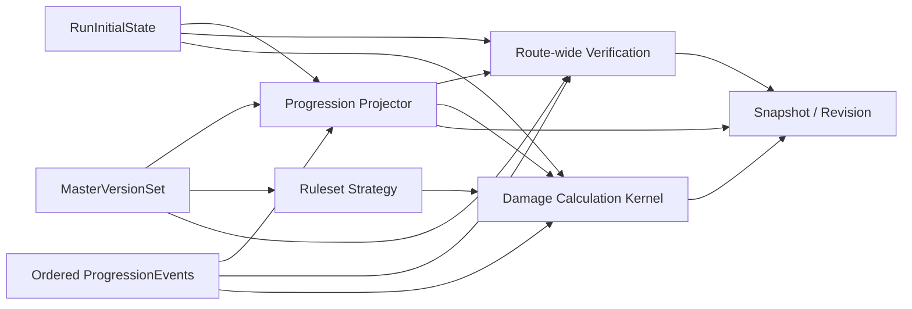

# Pokemon Story Damage Calculator API Foundation

## 概要

このドキュメントは Issue #1 の Pokemon story damage calculator foundation の実装内容をまとめるものです。`WeatherForecast` サンプルの置換後に公開されている API、authority model、認可境界、既知の簡略化を確認できます。

| 項目 | 内容 |
|---|---|
| 対象 Issue | #1 |
| Phase / Step | Phase 3 / Step 3.4.5 |
| 主目的 | 実装済み foundation API の責務境界と制約を記録する |
| 関連アーキテクチャ | [Architecture Overview](../architecture.md) |
| 関連テスト | [Pokemon Story Damage Calculator Foundation Test Plan](../tests/pokemon-story-damage-calculator-foundation-test-plan.md) |

## Status

| Field | Value |
|---|---|
| Document type | implementation-aligned design |
| Detail level | foundation API snapshot |
| Implementation stance | current branch implementation |

## 1. Implemented Foundation Snapshot

| Area | Current implementation |
|---|---|
| HTTP style | ASP.NET Core minimal API (`/api/**`) |
| AuthN | Google access token bearer。テストでは header ベースの test auth に差し替え |
| AuthZ | `/api/runs*`, `/api/routes*`, `/api/calculations*`, share write は所有者必須。`/api/admin*` は `Administrator` ロール必須 |
| Persistence | EF Core。通常は SQL Server、テストや指定時は InMemory |
| Startup behavior | production 以外は migration 試行後に seed を投入。開発環境のみ Swagger UI を公開 |
| Seed data | `Pokemon Emerald` ruleset 1 件と published master version set 1 件を投入 |

## 2. Module Boundaries

| Module | Responsibility | Notes |
|---|---|---|
| `Rulesets` | `Ruleset` と `MasterVersionSet` の参照・公開状態管理 | run 作成時は最新の published version set を採用する |
| `Scenarios` | `RunAggregate`, `RunInitialState`, `RoutePlan`, `ProgressionEvent`, `BattleDefinition`, `EnemyGroupDefinition` を管理する | `RunInitialState` は最大 6 体の baseline party を保持する |
| `Progression` | `BattleParticipationPlan`, `RouteProgressionProjection`, EXP / EV / PP の再導出を提供する | `StoryProgressionProjector` が damage とは別コードパスで処理する |
| `Calculations` | route verification、single-case damage、compare-patterns、threshold-search を提供する | type chart は `PokemonTypeChart` で一元化した |
| `Sharing` | `SharedRouteSnapshot`, `RouteRevision`, `ShareComment`, `ShareDiffResult` を扱う | mutable run/route から revision snapshot JSON を生成する |
| `IdentityAccess` | provider 非依存の current user abstraction と policy 名を提供する | Google claim は Web 層で吸収する |
| `AdminImports` | import job と master version publish を提供する | まだ workbook 内容の解析は行わない |

## 3. Authority Model

### 3.1 Authority Classification

| Category | Resource | Update rule | Used by |
|---|---|---|---|
| Editable authority | `RunInitialState` | `PUT /api/runs/{runId}/initial-state` で更新し revision を加算 | baseline money / party / move PP を保持し verification、progression、share snapshot に使う |
| Event authority | ordered `ProgressionEvent` | add / update / reorder 時に sequence と revision を更新 | battle-result / rare-candy / pp-restore / species-change などの再計算根拠になる |
| Editable scenario extension | `BattleDefinition` / `EnemyGroupDefinition` | user-owned run 配下で保存 | quick search、verification、damage 入力の参照 |
| Version authority | `MasterVersionSet` | seed、import commit、admin publish で更新 | run 作成、verification、damage source reference |
| Derived artifact | `RouteProgressionProjection` | request 時に再生成し PP warning や reserve EXP を可視化する | progression、damage warning、share snapshot |
| Derived artifact | `RouteVerificationResult` | request 時に再生成し route を非 stale 化 | route verification |
| Derived artifact | `DamageCalculationResult` / compare / threshold | request 時に計算 | explanation、formula trace |
| Immutable collaboration artifact | `SharedRouteSnapshot` / `RouteRevision` | publish 時のみ追加 | comments、diff、review |

### 3.2 Derivation Flow

### 3.3 Guardrails

- derived result は永続化の authority source にしない
- initial state、event、battle 変更後は route を stale に戻す
- share revision は route snapshot JSON を保存し、run/route 本体を直接書き換えない
- arbitrary battle は inline enemy を持つ前提、custom-group battle は既存 enemy group を参照する前提で扱う

## 4. Implemented API Surface

| Capability | Endpoint | Auth | Notes |
|---|---|---|---|
| rulesets | `GET /api/rulesets`, `GET /api/rulesets/{id}` | Anonymous | seed ruleset を含む参照 API |
| master version set inspect | `GET /api/master-version-sets/{id}` | Anonymous | run が参照している version set を確認できる |
| runs | `GET/POST /api/runs`, `GET/PUT /api/runs/{id}` | Run owner | run 作成時に最新 published version set を固定する |
| initial state | `GET/PUT /api/runs/{id}/initial-state` | Run owner | baseline money と最大 6 体 party を保持する |
| routes | `POST /api/runs/{runId}/routes`, `POST /api/routes/{id}:reorder` | Run owner | route 一覧 API は未追加。run 詳細レスポンスで参照する |
| progression events | `POST /api/routes/{id}/events`, `PUT /api/routes/{id}/events/{eventId}` | Run owner | per-member EXP / EV / PP delta、Rare Candy、species-change を表現する |
| enemy groups | `POST /api/runs/{runId}/enemy-groups`, `PUT /api/runs/{runId}/enemy-groups/{groupId}` | Run owner | custom-group battle の再利用単位 |
| battles | `POST /api/routes/{id}/battles`, `PUT /api/routes/{id}/battles/{battleId}`, `PUT /api/battles/{battleId}/participation` | Run owner | `custom-group` と `arbitrary` をサポートし、participation mode と manual outcome を更新できる |
| battle quick search | `GET /api/runs/{runId}/battles:search?keyword=` | Run owner | title または敵要約で検索する |
| progression projection | `GET /api/routes/{id}/progression`, `POST /api/routes/{id}:recalculate` | Run owner | per-member progression、reserve EXP、PP warning を返す |
| route verification | `POST /api/routes/{id}:verify`, `GET /api/routes/{id}/verification` | Run owner | progression warning も取り込む |
| damage | `POST /api/calculations/damage` | Run owner | STAB、中央管理のタイプ相性、急所、追加 modifiers、PP warning を適用 |
| compare-patterns | `POST /api/calculations/compare-patterns` | Run owner | base case に対する差分比較 |
| threshold-search | `POST /api/calculations/threshold-search` | Run owner | 初期状態と battle 先頭敵から候補探索 |
| shares | `POST /api/shares`, `GET /api/shares/{shareId}` | Write: Run owner / Read: `public` は Anonymous、それ以外は owner | `private` / `unlisted` は owner のみ参照できる |
| comments / revisions / diff | `GET/POST /api/shares/{shareId}/comments`, `GET /api/shares/{shareId}/revisions`, `GET /api/shares/{shareId}/diff`, `POST /api/shares/{shareId}:publish-revision` | Write: Run owner / Read: `public` は Anonymous、それ以外は owner | diff は構造差分のみ |
| admin import | `POST /api/admin/import-jobs:dry-run`, `POST /api/admin/import-jobs`, `GET /api/admin/import-jobs/{id}` | Admin | workbook 名を受け取り job を保存する |
| admin master maintenance | `GET /api/admin/master-version-sets`, `POST /api/admin/master-version-sets/{id}:publish` | Admin | publish は `IsPublished=true` へ更新する |

## 5. Core Resource Snapshot

| Resource | Key fields | Notes |
|---|---|---|
| `Ruleset` | `id`, `slug`, `generation`, `title`, `version`, `status`, `summary` | 現在の seed は `gen3-emerald-story` |
| `MasterVersionSet` | `id`, `rulesetId`, `label`, `importedAt`, `isPublished`, `versionCatalog`, `masterSources` | damage / experience / type chart / PP rule の版を分けて保持する |
| `RunAggregate` | `id`, `ownerUserId`, `rulesetId`, `masterVersionSetId`, `name`, `status`, `routes`, `enemyGroups` | owner は provider 非依存文字列 |
| `RunInitialState` | `revision`, `baselineMoney`, `baselineParty[]`, `memo` | IV / EV / nature / ability / held item / moves / PP を member ごとに保持する |
| `Route` | `routeId`, `runId`, `name`, `stale`, `progressionFingerprint`, `simulatedPartyMemberIds[]` | route ごとに主対象の手持ちを絞れる |
| `ProgressionEvent` | `id`, `sequence`, `eventType`, `summary`, `linkedBattleId`, `moneyDelta`, `partyDeltas[]`, `revision` | per-member EXP / EV / PP / rare candy / species-change を保持する |
| `EnemyGroupDefinition` | `id`, `runId`, `name`, `sourceKind`, `members[]` | members は type、base exp yield、EV yield も持つ |
| `BattleDefinition` | `id`, `routeId`, `title`, `sourceKind`, `battleKind`, `enemyGroupId`, `inlineEnemies`, `suggestedPartyMemberIds[]`, `participations[]`, `notes` | delete API は未提供 |
| `RouteProgressionProjection` | `routeId`, `partyMembers[]`, `warnings[]`, `progressionFingerprint` | PP 不足や reserve EXP 反映後の読取モデル |
| `RouteVerificationResult` | `routeId`, `verifiedAt`, `summary`, `issues[]`, `warnings[]`, `sourceReferences[]` | verification 実行で route を non-stale に戻す |
| `DamageCalculationResult` | `minimumDamage`, `maximumDamage`, `appliedModifiers[]`, `explanation[]`, `formulaTrace[]`, `warnings[]`, `sourceReferences[]` | PP warning を hard blocker にせず返す |
| `SharedRouteSnapshot` | `id`, `ownerUserId`, `runId`, `routeId`, `visibility`, `baseRevisionId`, `currentRevisionId`, `fixedVersionCatalog`, `revisions[]`, `comments[]` | revision 本文は snapshot JSON |
| `ImportJob` | `id`, `rulesetId`, `workbookName`, `mode`, `status`, `messages[]`, `publishedMasterVersionSetId` | commit 時だけ version set を追加作成する |

## 6. Known Simplifications and Limitations

- damage calculation は foundation 用の簡易式で、世代別の詳細ルールや複数防御指標までは扱わない
- progression projector は separate code path だが、EXP / EV / PP 式は foundation 向けの簡易係数で実装している
- threshold-search は run の初期状態と battle の先頭敵を使う簡易探索で、critical・追加 modifier・タイプ相性探索は行わない
- quick search は title と敵要約の部分一致検索のみ
- share visibility は `public` / `private` / `unlisted` を受け付けるが、現実装で匿名 read を許可するのは `public` のみ
- share diff は `route.name`、event 数、battle 数、initial-state revision に加え `damageRulesetVersion` / `experienceRulesetVersion` の差分を比較する
- import は workbook 名ベースの job / version set 作成までで、実ファイル解析や validation 詳細は stub
- delete API、pagination、optimistic concurrency、OpenAPI 用の詳細 schema 注釈は未導入
