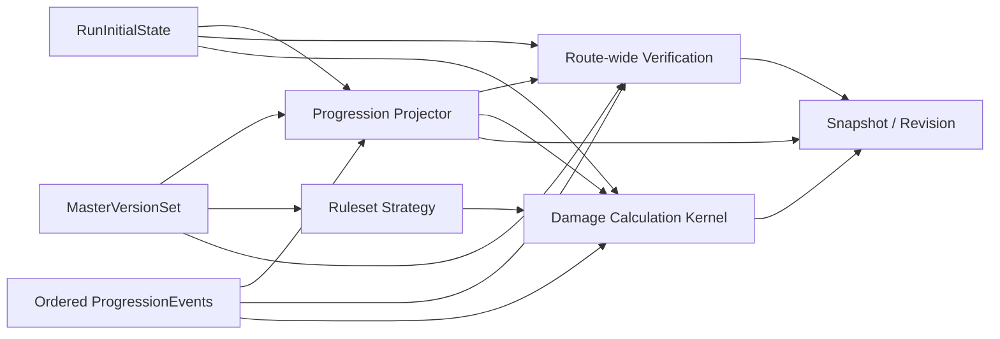

# Pokemon Story Damage Calculator API Design Contract

## 概要

このドキュメントは Issue #1 の Pokemon story damage calculator に対する承認済み API / データ契約をまとめるものです。Phase 2 の設計成果物として、authority model、API surface、share/import 再現性契約、テストで固定すべき境界を示します。

| 項目 | 内容 |
|---|---|
| 対象 Issue | #1 |
| Phase / Step | Phase 2 / Step 2.3 |
| 主目的 | 承認済み仕様を満たす API / データ契約を固定する |
| 関連アーキテクチャ | [Architecture Overview](../architecture.md) |
| 関連テスト | [Pokemon Story Damage Calculator Foundation Test Plan](../tests/pokemon-story-damage-calculator-foundation-test-plan.md) |

## Status

| Field | Value |
|---|---|
| Document type | design contract |
| Detail level | Phase 3 completion criteria ready |
| Implementation stance | approved-spec aligned |

## 1. Design Contract Snapshot

| Area | Required contract |
|---|---|
| HTTP style | ASP.NET Core minimal API (`/api/**`) |
| AuthN | Google access token bearer。テストでは header ベースの test auth に差し替え |
| AuthZ | `/api/runs*`, `/api/routes*`, `/api/calculations*` は所有者必須。share は `owner`, `viewer`, `commenter`, `reviser` の policy で read/comment/revise を分離し、`/api/admin*` は `Administrator` ロール必須 |
| Persistence | EF Core。通常は SQL Server、テストや指定時は InMemory |
| Startup behavior | production 以外は migration 試行後に seed を投入。開発環境のみ Swagger UI を公開 |
| Seed data | foundation ruleset と published master version set を投入し、version metadata 契約の雛形を提供する |

## 2. Module Boundaries

| Module | Responsibility | Notes |
|---|---|---|
| `Rulesets` | `Ruleset` と `MasterVersionSet` の参照・公開状態管理 | run 作成時は最新の published version set を採用する |
| `Scenarios` | `RunAggregate`, `RunInitialState`, `RoutePlan`, `ProgressionEvent`, `BattleDefinition`, `EnemyGroupDefinition` を管理する | `RunInitialState` は最大 6 体の baseline party を保持する |
| `Progression` | `BattleParticipationPlan`, `RouteProgressionProjection`, EXP / EV / PP の再導出を提供する | `StoryProgressionProjector` が damage とは別コードパスで処理する |
| `Calculations` | route verification、single-case damage、compare-patterns、threshold-search を提供する | threshold-search は compare-patterns と別責務で `allOf` 条件を評価する |
| `CalculationPresets` | `CalculationPreset` / `PatternTable` を user-owned resource として扱う | stable ID で保存し、damage / compare-patterns / threshold-search から参照する |
| `Sharing` | `ShareableSnapshot`, `SnapshotRevision`, `ShareComment`, `ShareDiffResult` を扱う | calculation / comparison / verification / route plan を generic source (`sourceType`, `sourceId`) として immutable snapshot JSON に固定する |
| `IdentityAccess` | provider 非依存の current user abstraction と policy 名を提供する | Google claim は Web 層で吸収する |
| `AdminImports` | import job、row-level validation、master version publish を提供する | dry-run / commit / audit trail を一つの契約で扱う |

## 3. Authority Model

### 3.1 Authority Classification

| Category | Resource | Update rule | Used by |
|---|---|---|---|
| Editable authority | `RunInitialState` | `PUT /api/runs/{runId}/initial-state` で更新し revision を加算 | baseline money / party / move PP を保持し verification、progression、share snapshot に使う |
| Event authority | ordered `ProgressionEvent` | add / update / reorder 時に sequence と revision を更新 | battle-result / item-use / rare-candy / pp-restore / species-change / move-change などの再計算根拠になる |
| Editable scenario extension | `BattleDefinition` / `EnemyGroupDefinition` | user-owned run 配下で保存 | quick search、verification、damage 入力の参照 |
| Version authority | `MasterVersionSet` | seed、import commit、admin publish で更新 | run 作成、verification、damage source reference |
| Derived artifact | `RouteProgressionProjection` | request 時に再生成し PP warning や reserve EXP を可視化する | progression、damage warning、share snapshot |
| Derived artifact | `RouteVerificationResult` | request 時に再生成し stale metadata を返す | route verification |
| Derived artifact | `DamageCalculationResult` / compare / threshold | request 時に計算 | explanation、formula trace、minimum threshold answer |
| Editable authority | `CalculationPreset` / `PatternTable` | create / update 時に revision を加算 | IV range、EV pattern、nature pattern の保存・比較に使う |
| Immutable collaboration artifact | `ShareableSnapshot` / `SnapshotRevision` | publish 時のみ追加 | comments、diff、review、snapshot replay |

### 3.2 Derivation Flow

### 3.3 Guardrails

- derived result は永続化の authority source にしない
- initial state、event、battle 変更後は route を stale に戻す
- share revision は route snapshot JSON を保存し、run/route 本体を直接書き換えない
- arbitrary battle は inline enemy を持つ前提、custom-group battle は既存 enemy group を参照する前提で扱う
- `progressionFingerprint` は `initialStateRevision`, ordered `progressionEventRevision`, version set digest から決定論的に生成する
- snapshot diff は metadata key の欠落自体も差分とみなす
- compare-patterns は minimum threshold answer を返さない
- snapshot metadata には、実計算で参照した追加 master group と share policy も固定する

## 4. Planned API Surface

| Capability | Endpoint | Auth | Notes |
|---|---|---|---|
| rulesets | `GET /api/rulesets`, `GET /api/rulesets/{id}` | Anonymous | seed ruleset を含む参照 API |
| master version set inspect | `GET /api/master-version-sets/{id}` | Anonymous | run が参照している version set を確認できる |
| runs | `GET/POST /api/runs`, `GET/PUT /api/runs/{id}` | Run owner | run 作成時に最新 published version set を固定する |
| initial state | `GET/PUT /api/runs/{id}/initial-state` | Run owner | baseline money と最大 6 体 party を保持する |
| routes | `POST /api/runs/{runId}/routes`, `POST /api/routes/{id}:reorder` | Run owner | route 一覧 API は未追加。run 詳細レスポンスで参照する |
| progression events | `POST /api/routes/{id}/events`, `PUT /api/routes/{id}/events/{eventId}` | Run owner | `battle-result`, `item-use`, `rare-candy`, `pp-restore`, `species-change`, `move-change` を表現し、per-member EXP / EV / PP delta と move / held-item 変更を保持する |
| enemy groups | `POST /api/runs/{runId}/enemy-groups`, `PUT /api/runs/{runId}/enemy-groups/{groupId}` | Run owner | custom-group battle の再利用単位 |
| battles | `POST /api/routes/{id}/battles`, `PUT /api/routes/{id}/battles/{battleId}`, `PUT /api/battles/{battleId}/participation` | Run owner | `custom-group` と `arbitrary` をサポートし、participation mode と manual outcome を更新できる |
| battle quick search | `GET /api/runs/{runId}/battles:search?keyword=` | Run owner | title または敵要約で検索する |
| progression projection | `GET /api/routes/{id}/progression`, `POST /api/routes/{id}:recalculate` | Run owner | per-member progression、reserve EXP、PP warning を返す |
| route verification | `POST /api/routes/{id}:verify`, `GET /api/routes/{id}/verification` | Run owner | progression warning も取り込む |
| damage | `POST /api/calculations/damage` | Run owner | STAB、中央管理のタイプ相性、急所、追加 modifiers、PP warning を適用 |
| calculation presets / pattern tables | `GET/POST /api/presets`, `GET/PUT /api/presets/{presetId}` | Run owner | preset は stable ID を持ち、IV ranges、EV patterns、nature patterns を保持する |
| compare-patterns | `POST /api/calculations/damage:compare-patterns` | Run owner | ケース比較結果のみを返し、minimum threshold answer は返さない |
| threshold-search | `POST /api/calculations/damage:search-thresholds` | Run owner | `hp`, `attack`, `defense`, `specialAttack`, `specialDefense`, `speed` の IV を 0..31 の整数・1 刻みで探索し、`allOf` 条件に対して `solved` / `no-solution` / `multiple-minimal-solutions` と `bestSolution` / `allMinimalSolutions` / `searchedRangeSummary` / `unsatisfiedConditions` を返す。`minimum-damage-at-least`, `maximum-damage-at-most`, `action-order-at-least` などの条件を扱い、`anyOf` や priority 指定は validation error |
| shares | `POST /api/shares/snapshots`, `GET /api/shares/{shareId}` | Write: Run owner / Read: policy-based | snapshot は `sourceType`, `sourceId`, fixed version set, `importJobIds[]`, digest を固定し、viewer 権限で read できる |
| comments / revisions / diff | `GET/POST /api/shares/{shareId}/comments`, `POST /api/shares/{shareId}:diff`, `POST /api/shares/{shareId}:revise`, `GET /api/shares/{shareId}/revisions` | Comment: commenter / Revise: reviser / Diff: viewer 以上 | diff は route 順序、前提値、結果差分、share policy 差分、metadata key 欠落を比較対象に含める |
| admin import | `POST /api/admin/imports`, `GET /api/admin/imports/{id}` | Admin | `mode` と `sourceType` で dry-run / commit を切り替え、row-level validation と duplicate summary を返す |
| admin master maintenance | `GET /api/admin/master-version-sets`, `POST /api/admin/master-version-sets/{id}:publish` | Admin | publish は `IsPublished=true` へ更新する |

## 5. Core Resource Snapshot

| Resource | Key fields | Notes |
|---|---|---|
| `Ruleset` | `id`, `slug`, `generation`, `title`, `version`, `status`, `summary` | 現在の seed は `gen3-emerald-story` |
| `MasterVersionSet` | `id`, `rulesetId`, `label`, `importedAt`, `isPublished`, `versionCatalog`, `masterSources`, `importJobIds[]` | damage / experience / pokemon / move / ability / item / type chart / nature / story enemy / experience table / EV / PP の版を分けて保持する |
| `RunAggregate` | `id`, `ownerUserId`, `rulesetId`, `masterVersionSetId`, `name`, `status`, `routes`, `enemyGroups` | owner は provider 非依存文字列 |
| `RunInitialState` | `revision`, `baselineMoney`, `baselineParty[]`, `memo` | IV / EV / nature / ability / held item / moves / PP を member ごとに保持する |
| `Route` | `routeId`, `runId`, `name`, `stale`, `initialStateRevision`, `orderedProgressionEventRevision`, `progressionFingerprint`, `simulatedPartyMemberIds[]` | route ごとに主対象の手持ちを絞れる |
| `CalculationPreset` | `presetId`, `runId`, `revision`, `ivRanges`, `evPatterns[]`, `naturePatterns[]`, `notes` | compare / threshold / shared snapshot の参照元になる stable resource |
| `ProgressionEvent` | `id`, `sequence`, `eventType`, `summary`, `linkedBattleId`, `moneyDelta`, `partyDeltas[]`, `itemUsage[]`, `moveChanges[]`, `revision` | `battle-result`, `item-use`, `rare-candy`, `pp-restore`, `species-change`, `move-change` を保持し、per-member EXP / EV / PP / held item / move set の変化を再導出する |
| `EnemyGroupDefinition` | `id`, `runId`, `name`, `sourceKind`, `members[]` | members は type、base exp yield、EV yield も持つ |
| `BattleDefinition` | `id`, `routeId`, `title`, `sourceKind`, `battleKind`, `enemyGroupId`, `inlineEnemies`, `suggestedPartyMemberIds[]`, `participations[]`, `notes` | delete API は未提供 |
| `RouteProgressionProjection` | `routeId`, `partyMembers[]`, `warnings[]`, `progressionFingerprint` | PP 不足や reserve EXP 反映後の読取モデル |
| `RouteVerificationResult` | `routeId`, `verifiedAt`, `summary`, `issues[]`, `warnings[]`, `sourceReferences[]` | verification 実行で route を non-stale に戻す |
| `DamageCalculationResult` | `minimumDamage`, `maximumDamage`, `appliedModifiers[]`, `explanation[]`, `formulaTrace[]`, `warnings[]`, `sourceReferences[]` | PP warning を hard blocker にせず返す |
| `ThresholdSearchResult` | `status`, `bestSolution`, `allMinimalSolutions[]`, `searchedRangeSummary`, `unsatisfiedConditions[]` | `status` は `solved` / `no-solution` / `multiple-minimal-solutions` |
| `ShareableSnapshot` | `shareId`, `sourceType`, `sourceId`, `ownerUserId`, `visibility`, `allowedRoles[]`, `baseRevisionId`, `currentRevisionId`, `fixedVersionCatalog`, `importJobIds[]`, `additionalMasterGroups[]`, `sharePolicyDigest`, `progressionFingerprint`, `calculationInputDigest`, `calculationOutputDigest`, `revisions[]`, `comments[]` | revision 本文は snapshot JSON、metadata key 欠落と share policy 差分も diff 対象 |
| `ImportJob` | `id`, `rulesetId`, `sourceType`, `sourceMetadata`, `mode`, `status`, `rowResults[]`, `duplicateSummary`, `messages[]`, `publishedMasterVersionSetId`, `auditTrail` | dry-run / commit の両方で row-level validation を返す |

## 6. Phase 3 Implementation Constraints

- damage calculation と progression logic は separate code path を維持しつつ、Phase 3 では ruleset-versioned strategy の差し替え余地を保つ
- damage / EXP / EV / PP の詳細式は foundation 実装から段階拡張されうるが、response 契約自体は中間式・補正内訳・使用 version を返す
- threshold-search は簡易探索に縮退させず、専用 API と専用 response shape を維持する
- share visibility は匿名可否だけでなく `owner` / `viewer` / `commenter` / `reviser` の操作権限で定義する
- share diff は version metadata key の欠落と値差分の両方を扱う
- import は workbook メタデータ登録で終えず、row-level validation / duplicate summary / audit trail までを API 契約に含める
- delete API、pagination、optimistic concurrency は Phase 3 以降の拡張対象として残りうるが、承認済み snapshot / threshold / import 契約を狭める理由にはしない
