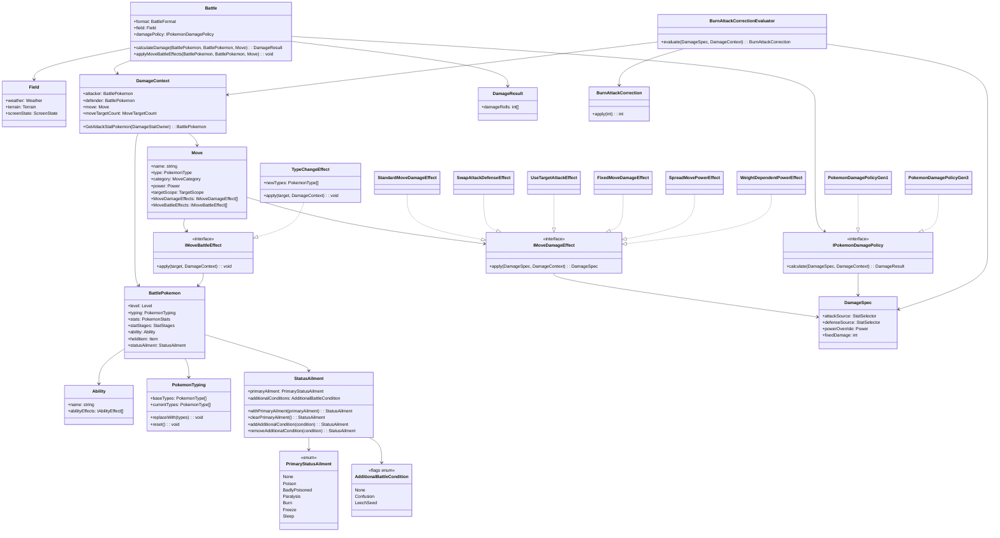

# Domain モデル

> 対象: 戦闘中のダメージ計算と状態変化を扱う Domain モデル

---

## 概要

このドキュメントは、ダメージ計算に加えて、みずびたしのような「相手のタイプを書き換える技」をオブジェクト指向的にどう表現するかを示す。

| 項目 | 方針 |
|------|------|
| タイプ情報 | `BattlePokemon` に直接生の配列を持たせず、`PokemonTyping` で元タイプと現在タイプを管理する |
| 技の効果 | ダメージ計算を組み立てる効果と、戦闘状態を変化させる効果を分離する |
| みずびたし | `TypeChangeEffect` が対象ポケモンの `PokemonTyping` を水単タイプへ更新する |
| 状態異常 | `StatusAilment` が「主要状態異常 1 つ」と「併用可能状態の集合」を分けて保持する |

---

## 設計方針

みずびたしのような技は、単なるダメージ補正ではなく「戦闘中の対象ポケモンの状態変化」である。
そのため、`DamageSpec` に無理に押し込まず、`BattlePokemon` が保持する戦闘状態として型変更を扱う。

具体的には次のように分離する。

- `IMoveDamageEffect`: ダメージ計算式の構築だけを担当する
- `IMoveBattleEffect`: タイプ変更など、戦闘状態の変更を担当する
- `PokemonTyping`: 元タイプと現在タイプを保持し、タイプ変更の適用先になる
- `StatusAilment`: どくやまひのような排他的状態と、混乱ややどりぎのたねのような併用可能状態をまとめて管理する

## クラス図

## みずびたしの表現

`みずびたし` は `TypeChangeEffect` の具体例として表現できる。

- 対象は防御側の `BattlePokemon`
- 効果適用時に `target.typing.replaceWith([Water])` を実行する
- 以後のタイプ一致補正やタイプ相性判定では `currentTypes` を参照する
- 戦闘終了や交代時に必要なら `reset()` で元タイプへ戻す

この形にしておくと、`みずびたし` だけでなく、`さまようたましい` のような状態変化や、`でんこうそうげき` とは別系統の戦闘効果も同じ拡張点に載せられる。

## 状態異常の表現

状態異常は 1 つの列挙体に全てを詰めるより、役割の異なる 2 系統に分けて `StatusAilment` へまとめるのが扱いやすい。

- `PrimaryStatusAilment`: どく、もうどく、まひ、やけど、こおり、ねむりのように同時成立しない主要状態
- `AdditionalBattleCondition`: 混乱、やどりぎのたねのように主要状態と併用できる追加状態

この形にすると、`BattlePokemon` からは `statusAilment` という単一の戦闘状態として扱える一方で、ルール上の排他制約は型の構造で自然に表現できる。

- `どく` と `まひ` は `primaryAilment` を置き換える関係として表現する
- `どく` と `混乱` は `primaryAilment + additionalConditions` の組み合わせで表現する
- `どく` と `混乱` と `やどりぎのたね` は `PrimaryStatusAilment.Poison` と `AdditionalBattleCondition.Confusion | AdditionalBattleCondition.LeechSeed` で表現する